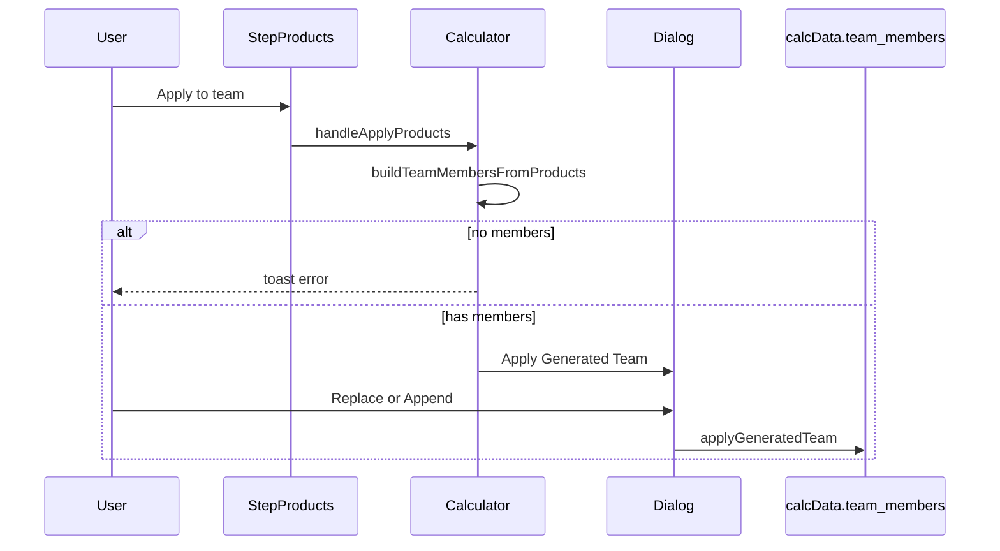
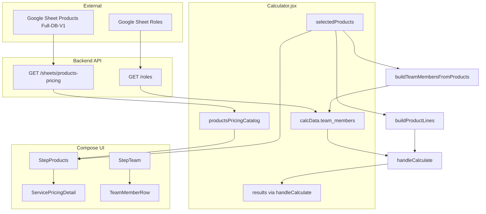

# Compose Scope Section — Full UX/UI & Architecture Export

**Purpose:** Complete documentation of the **Scope** deal step (`compose`) — everything visible when the user selects **Scope** in the stepper, including **Products pricing builder**, **Internal team**, and surrounding chrome (header strip, data bar, sidebar, right rail).  
**Use for:** Redesign of the fragmented layout shown in the Calculator screenshot.  
**Related (different step):** Opportunity sheet scope lives on the **Opportunity** step — see [`scope-section-redesign-brief.md`](scope-section-redesign-brief.md).

**Redesign audit quartet (split, opinionated):**

- [`compose-step-audit.md`](compose-step-audit.md) — architecture and state  
- [`compose-step-ui-map.md`](compose-step-ui-map.md) — zones, visibility, wireframes  
- [`compose-step-issues.md`](compose-step-issues.md) — fragmentation and duplication register  
- [`compose-step-redesign-options.md`](compose-step-redesign-options.md) — hierarchy and options A/B/C  

**Last aligned with codebase:** May 2026.

---

## 1. What this section is (vs Opportunity step)

| User label in UI | Deal step ID | DOM / route context |
|------------------|--------------|---------------------|
| **Opportunity** | `frame` | `#project` — ID load, BD scope list |
| **Scope** (this document) | `compose` | `#products` + `#team` — pricing builder |
| Economics | `economics` | vendors + margin center |
| Review | `review` | summary + PDF |

When the user clicks **Scope** in the left stepper, they see (on desktop, with default visibility rules):

1. **Data sources bar** + **Show all sections** toggle  
2. **Products pricing builder** card (`#products`)  
3. **Internal team** card (`#team`) — below products on large screens  
4. **Right rail:** live quote / insight panel  
5. **Global header:** Selling price + margin (sticky strip above content)

On **mobile**, Products and Team are **tabs** — only one card visible unless “Show all sections” is on.

---

## 2. Page layout (full chrome)

```text
┌─────────────────────────────────────────────────────────────────────────────┐
│ App header: ZAN OPE · Selling price · Margin · deal size badge · Admin…      │  QuoteHealthStrip (sticky)
├─────────────────────────────────────────────────────────────────────────────┤
│ Horizontal DealStepper: Opportunity | Scope | Economics | Review             │
├──────────┬──────────────────────────────────────────────────┬───────────────┤
│ Sidebar  │ Main column                                       │ InsightRail   │
│ (lg+)    │                                                   │ (lg+, sticky) │
│          │ [DataSourcesStatus] [Show all sections Switch]      │               │
│ Deal     │ [Mobile: Products | Team tabs]                      │ Selling price │
│ steps    │ ┌─ Products pricing builder ─────────────────┐    │ COGS / margin │
│          │ │ toolbar + product rows + sheet detail      │    │ alerts        │
│ Templates│ └────────────────────────────────────────────┘    │ PDF export    │
│          │ ┌─ Internal team ────────────────────────────┐    │               │
│          │ │ picker + member rows + risk collapsible  │    │               │
│          │ └────────────────────────────────────────────┘    │               │
└──────────┴──────────────────────────────────────────────────┴───────────────┘
│ BottomNav (mobile): frame | compose | economics | more | insight            │
└─────────────────────────────────────────────────────────────────────────────┘
```

**Grid:** `lg:grid-cols-[240px_1fr_360px]` in [`Calculator.jsx`](../frontend/src/pages/Calculator.jsx).

---

## 3. Visibility rules (why it feels “everything in a different place”)

Logic: `isSectionVisible(sectionId)` in `Calculator.jsx`.

| Mode | Products visible | Team visible |
|------|------------------|--------------|
| `activeDealStep === 'compose'` + desktop (`lg+`) | Yes | Yes (stacked) |
| `activeDealStep === 'compose'` + mobile | One of two via `composeSubTab` | One of two |
| `expandAllSections === true` | Yes (with other steps’ sections) | Yes |

**Compose sub-tabs (mobile only):**

- State: `composeSubTab` — `'products'` | `'team'`
- UI: pill switcher above main content
- Click scrolls to `#products` or `#team`

**Footer continue buttons:**

- `StepProducts`: **Continue to Economics** only if Team section is **hidden** (`onContinue={showTeam ? undefined : onContinue}`)
- `StepTeam`: always gets **Continue to Economics** when team is shown

So on desktop you may see **two** “Continue to Economics” footers if both cards render.

---

## 4. Products pricing builder — UI specification

**Component:** [`StepProducts.jsx`](../frontend/src/components/calculator/StepProducts.jsx)  
**Section ID:** `products`  
**Test IDs:** `products-pricing-toolbar`, product row has no row-level test id

### 4.1 Card structure (top → bottom)

```text
┌─ Card: Products pricing builder ─────────────────────────────────────────────┐
│ HEADER (flex justify-between)                                               │
│   [violet icon] Title + description + "Last synced: …"                        │
│   [Refresh sheet] outline button                                            │
├─────────────────────────────────────────────────────────────────────────────┤
│ TOOLBAR (border-b, px-6, flex-wrap)                                         │
│   [Filter: All service families ▼]  [+ Add product]  [Apply to team] violet │
├─────────────────────────────────────────────────────────────────────────────┤
│ BODY (CardContent, space-y-3)                                               │
│   FOR EACH selectedProducts row:                                              │
│     ┌─ 12-col grid row (border, rounded-lg, p-3) ────────────────────────┐   │
│     │ col-5 Service name ▼ │ col-3 Segment ▼ │ col-2 Qty │ col-2 🗑      │   │
│     │ [ServicePricingDetail full width col-12 if name+size set]         │   │
│     └────────────────────────────────────────────────────────────────────┘   │
│   [StepContinueFooter: Continue to Economics →]  (conditional)               │
└─────────────────────────────────────────────────────────────────────────────┘
```

### 4.2 Header copy & actions

| Element | Text / behavior |
|---------|-----------------|
| Title | Products pricing builder |
| Description | Select service, segment, and quantity. Refresh syncs Full-DB-V1 from Google Sheet. |
| Last synced | Locale string from `productsPricingSyncedAt` |
| Refresh sheet | `loadProductsPricingCatalog(true)` — outline, disabled while loading |

**Icon:** `LayoutTemplate`, violet-tinted box (`bg-violet-500/10`).

### 4.3 Toolbar controls

| Control | Width | Action |
|---------|-------|--------|
| Family filter | `sm:w-[260px]` | `selectedSection` / `setSelectedSection`; options from `sectionOptions` |
| Add product | outline | Appends row: `{ id, product_name: '', size: 'tiny', quantity: 1 }` |
| Apply to team | **violet filled** | `handleApplyProducts` → opens **Apply Generated Team** dialog |

**Empty catalog:** Apply disabled when `filteredProductsCatalog.length === 0`.

### 4.4 Product row (input band)

**Layout:** `grid grid-cols-12 gap-3` — feels tight on small widths; detail panel is `col-span-12` below.

| Column | Field | Control | Notes |
|--------|-------|---------|-------|
| 5 | Service name | Searchable `Select` | Options: `{name} ({family})` from `filteredProductsCatalog` |
| 3 | Segment | `Select` | Keys from `product.segments` or `product.sizes`; labels UPPERCASE |
| 2 | Qty | `number` input | min 1, integer parse |
| 2 | Delete | ghost + Trash | Cannot delete last row (keeps 1 empty row) |

**On service change:** Resets segment to **first** segment key on that product.

**Default new row:** `size: 'tiny'` (import from opportunity uses `standard` — inconsistency).

### 4.5 ServicePricingDetail (nested “SHEET PRICING” panel)

**Component:** [`ServicePricingDetail.jsx`](../frontend/src/components/ServicePricingDetail.jsx)  
**Renders when:** `item.product_name && item.size` and `segmentPayload` exists

**Visual:** Full-width under row; `col-span-12`; violet border/fill (`border-violet-500/30 bg-violet-500/5` dark).

#### Metrics row (left)

| Label | Source field | Display |
|-------|--------------|---------|
| Sheet pricing (×qty) | — | Section title |
| Base min. selling (O) | `base_minimum_selling_price × qty` | Large emerald mono |
| Total cost (J) | `total_cost × qty` | Large white mono |
| Min. selling (L) | `minimum_selling_price × qty` | Shown only if ≠ base min |

#### Badges (right)

| Badge | Condition |
|-------|-----------|
| Execution mode | `execution_mode` → All-in / Resource / Hybrid label |
| Execution risk | `execution_risk` + warning icon |
| Min margin X% | `minimum_margin_percent > 0` |
| Nh team | `total_team_hours > 0` |

**Subtext:** `costBasisDescription(...)` one line under badges.

#### Action buttons (second row)

| Button | Opens / links |
|--------|----------------|
| Deliverables | Dialog + copy (amber styling) |
| Modifications | Dialog + copy (blue styling) |
| Detailed sheet | External URL from `detailed_sheet_url` |
| Reference(s) | URL or text dialog |

**UX note:** This panel is **heavy** — duplicates information that also affects header strip, Economics margins, and team auto-sync. Major contributor to “cluttered” feel.

### 4.6 Empty states

| Condition | UI |
|-----------|-----|
| Catalog empty after load | `QuoteEmptyState`: “Pick a service from your catalog” + Refresh |
| Catalog has data | List of product rows (may include empty placeholder row) |

---

## 5. Internal team — UI specification

**Component:** [`StepTeam.jsx`](../frontend/src/components/calculator/StepTeam.jsx)  
**Section ID:** `team`  
**Test ID:** `team-section`

### 5.1 Card structure

```text
┌─ Card: Internal team ───────────────────────────────────────────────────────┐
│ HEADER: blue Users icon · title · description · [Refresh sheet]              │
├─────────────────────────────────────────────────────────────────────────────┤
│ DepartmentRolePicker (add by department/role)                                │
│ IF team_members.length === 0 → QuoteEmptyState (compact)                     │
│ ELSE → "Selected team (N)" + TeamMemberRow list                              │
│ IF team_members.length > 0 → Collapsible "Internal risk factors" (3 selects) │
│ [StepContinueFooter: Continue to Economics →]                                │
└─────────────────────────────────────────────────────────────────────────────┘
```

### 5.2 TeamMemberRow (per member)

**Component:** [`TeamMemberRow.jsx`](../frontend/src/components/TeamMemberRow.jsx)

Typical fields: role, hours / utilization, hybrid included vs billable hours, rate preview, remove.

**Hybrid products:** Shows included vs billable hours when `labor_charge_context === 'hybrid'`.

### 5.3 Internal risk (collapsible)

Only visible when at least one team member exists.

Three dropdowns: `complexity`, `rush`, `execution` — each `none | low | medium | high`.  
Stored in `calcData.internal_risk`.

---

## 6. Surrounding UI (not inside cards but part of Scope experience)

### 6.1 DataSourcesStatus

**File:** [`DataSourcesStatus.jsx`](../frontend/src/components/calculator/DataSourcesStatus.jsx)  
**Placement:** Top of main column, every active step (including Scope).

| Piece | Meaning |
|-------|---------|
| Green/amber dot | Products sync freshness |
| Products · Just now / Xm ago | `productsPricingSyncedAt` |
| N roles | `roles.length` |
| Sync button | Refreshes products catalog + roles |

### 6.2 Show all sections

- `Switch` + label “Show all sections”
- When on: all deal step sections visible at once (long scroll)
- When off: only current step’s sections

### 6.3 QuoteHealthStrip (global header)

**File:** [`QuoteHealthStrip.jsx`](../frontend/src/components/calculator/QuoteHealthStrip.jsx)

| Metric | Source |
|--------|--------|
| Selling price | `results.selling_price` |
| Margin % | `results.contribution_margin_percent` (color thresholds 30/20) |
| Deal size badge | `results.incentive_breakdown.deal_size` (e.g. TINY) |
| Floor warning | `sheetPriceFloorWarning` — e.g. below sheet minimum (O) |

**Sticky:** `top-[73px]` — competes visually with horizontal stepper.

### 6.4 Left sidebar

| Block | Component | Scope-related behavior |
|-------|-----------|------------------------|
| Deal steps | `DealStepper` | Scope = `compose`; green check when valid product OR team |
| Templates | `TemplatePanel` | Load/save scope templates (products + team + vendors) |

### 6.5 Right InsightRail

**File:** [`InsightRail.jsx`](../frontend/src/components/calculator/InsightRail.jsx)

When no results: CTA **Go to Scope**.  
When results: duplicate selling price, COGS collapsibles, margin stack, intelligence alerts, PDF export, save template.

**Duplication:** Selling price + margin appear in header strip AND insight rail AND (on Economics) sticky summary.

### 6.6 Bottom navigation (mobile)

`BottomNav` — tabs for frame / compose / economics / more / insight.

---

## 7. State & data model

### 7.1 `selectedProducts` (primary Scope state)

**Owner:** `Calculator.jsx`  
**Initial:** One row `{ id, product_name: '', size: 'tiny', quantity: 1 }`

```typescript
{
  id: string;
  product_name: string;      // catalog service name
  size: string;              // segment: tiny | standard | big | mega
  quantity: number;
  margin_percent?: number;   // used later in Economics (granular)
  margin_source?: string;
  locked?: boolean;
}
```

**Derived lists:**

- `sectionOptions` — `['all', ...unique service_family]`
- `filteredProductsCatalog` — catalog filtered by family

### 7.2 `productsPricingCatalog`

Loaded via `GET /api/sheets/products-pricing` → grouped services with `segments[segmentKey]` payloads (sheet columns J, O, L, roles, execution mode, deliverables text, URLs, etc.).

**Helpers:**

- `findCatalogProduct(name)` — match `service_name` or `product_name`
- `getSegmentPayload(product, segment)` — `product.segments[segment]`

### 7.3 `calcData.team_members`

Synced from products via:

1. **Auto-sync** (debounced 300ms) — resource/hybrid segments only; replaces team when hours change  
2. **Apply to team** button — manual; opens replace/append dialog

**Builder:** `buildTeamMembersFromProducts()` — aggregates hours from `internal_roles` on each line, matches roles by name.

### 7.4 UI-only state

| State | Purpose |
|-------|---------|
| `composeSubTab` | Mobile products vs team |
| `expandAllSections` | Show all step sections |
| `applyProductsDialogOpen` | Replace vs append team |
| `pendingTeamMembers` | Staging for apply dialog |
| `productsTeamLink` | `'replace'` when team was replaced from products — shown in InsightRail |
| `selectedSection` | Family filter for dropdown |

### 7.5 Completion & calculation triggers

**Step complete (`compose`):** Valid product row OR any team member.

**`handleCalculate` dependencies include `selectedProducts`:**

- Builds `product_lines` via `buildProductLines` when `margin_mode === 'granular'`
- Otherwise products contribute via team/vendor paths and granular flags

**Sheet floor warning:** `getSheetMinimumTotal()` sums `base_minimum_selling_price × qty` across valid lines — drives header warning when selling &lt; floor.

---

## 8. User flows (behavioral)

### 8.1 Add and configure a product

1. User clicks **Add product** (or arrives from opportunity import).  
2. Selects **Service name** from filtered catalog.  
3. Selects **Segment** (tiny/standard/big/mega).  
4. Sets **Qty**.  
5. **ServicePricingDetail** expands with sheet metrics and badges.  
6. Changing qty/margin later in Economics may recalculate; segment cost display updates with qty.

### 8.2 Apply products → team



**Auto-sync (parallel path):** 300ms after product/segment/qty change → may **replace** `team_members` without dialog if syncable execution modes exist.

### 8.3 Continue to Economics

- From Products footer (if Team hidden) OR Team footer.  
- `goToDealStep('economics')` — scroll to vendors/pricing.  
- Products margins edited in **Margin Control Center** (Economics), not in Scope step.

### 8.4 Templates

Load template → can restore `selectedProducts`, team, vendors, margins (see `loadScopeTemplate` in Calculator.jsx).

---

## 9. Architecture diagram (data)



---

## 10. Component & file reference

| File | Responsibility |
|------|----------------|
| [`Calculator.jsx`](../frontend/src/pages/Calculator.jsx) | All state, handlers, layout grid, visibility, dialogs |
| [`StepCompose.jsx`](../frontend/src/components/calculator/StepCompose.jsx) | Wrapper: products then team |
| [`StepProducts.jsx`](../frontend/src/components/calculator/StepProducts.jsx) | Products card UI |
| [`ServicePricingDetail.jsx`](../frontend/src/components/ServicePricingDetail.jsx) | Per-line sheet economics panel |
| [`StepTeam.jsx`](../frontend/src/components/calculator/StepTeam.jsx) | Team card UI |
| [`TeamMemberRow.jsx`](../frontend/src/components/TeamMemberRow.jsx) | Single team member editor |
| [`DepartmentRolePicker.jsx`](../frontend/src/components/DepartmentRolePicker.jsx) | Add roles by department |
| [`quoteSteps.js`](../frontend/src/components/calculator/quoteSteps.js) | Step IDs, completion rules |
| [`DataSourcesStatus.jsx`](../frontend/src/components/calculator/DataSourcesStatus.jsx) | Sync status bar |
| [`QuoteHealthStrip.jsx`](../frontend/src/components/calculator/QuoteHealthStrip.jsx) | Global price/margin header |
| [`InsightRail.jsx`](../frontend/src/components/calculator/InsightRail.jsx) | Right column quote breakdown |
| [`TemplatePanel.jsx`](../frontend/src/components/calculator/TemplatePanel.jsx) | Sidebar templates |
| [`StepContinueFooter.jsx`](../frontend/src/components/calculator/StepContinueFooter.jsx) | Purple continue CTA |
| [`QuoteEmptyState.jsx`](../frontend/src/components/calculator/QuoteEmptyState.jsx) | Empty catalog / empty team |
| [`marginEngine.js`](../frontend/src/lib/marginEngine.js) | `buildProductLines`, product line economics |
| [`pricingCostRules.js`](../frontend/src/lib/pricingCostRules.js) | Execution mode labels, cost basis copy |

---

## 11. Design tokens & patterns (current)

| Pattern | Usage in Scope |
|---------|----------------|
| Cards | `rounded-xl`, `dark-card` or white border |
| Primary CTA | Violet `bg-violet-600` (Apply to team, Continue) |
| Products accent | Violet icon/bg |
| Team accent | Blue icon/bg |
| Sheet detail accent | Violet nested panel |
| Success numbers | Emerald mono (min selling) |
| Typography | Title `text-lg`, labels `text-sm`, meta `text-xs` |
| Spacing | Main `space-y-6` between sections; row `p-3` |

**Dark mode:** Default `isDarkMode === true` — neutral-900/950 backgrounds, neutral-700 borders.

---

## 12. Test IDs (automation)

| testid | Location |
|--------|----------|
| `products-pricing-toolbar` | Products toolbar |
| `team-section` | Team card |
| `data-sources-status` | Data bar |
| `expand-all-sections` | Switch |
| `quote-health-strip` | Header metrics |
| `dashboard` | InsightRail |
| `template-panel` | Sidebar templates |
| `template-select` | Template dropdown |

Product rows lack per-row test ids (gap for redesign).

---

## 13. Known UX problems (why it feels “مكعّب” / fragmented)

Documented for redesign — matches user feedback:

1. **Split across 2 tall cards** — Products and Team feel like separate apps; relationship only via Apply/auto-sync.  
2. **Triple price/margin surfaces** — Header strip + Insight rail + (later) Sticky economics summary.  
3. **ServicePricingDetail inside every row** — Large nested panel; badges + 4+ buttons; repeats sheet data.  
4. **Toolbar overload** — Filter, add, apply on one row; Apply competes with Continue at bottom of long scroll.  
5. **12-column grid** — Service/Segment/Qty cramped; detail full width below breaks visual grouping.  
6. **Duplicate Continue** — Two footers on desktop when both sections visible.  
7. **Mobile tab split** — Products vs Team hidden from each other unless user switches.  
8. **Inconsistent defaults** — New row `tiny` vs opportunity import `standard`.  
9. **Silent auto team replace** — 300ms debounce can overwrite manual team edits without modal (only Apply uses dialog).  
10. **Margin editing not in Scope** — User configures products here but margins in Economics — cognitive split.  
11. **Catalog filter affects dropdown only** — Not obvious which families have selected lines.  
12. **No link back to Opportunity scope lines** — Imported BD lines not shown on compose step.

---

## 14. Redesign recommendations (checklist)

### 14.1 Information architecture

- [ ] Single **Scope** surface with Products | Team as **tabs or side panel** on desktop too (optional), not only mobile  
- [ ] One sticky **Scope summary bar**: line count, total sheet min (O), sync status, primary CTA  
- [ ] Move sheet detail to **drawer/side panel** on row focus instead of inline expand  
- [ ] Show **BD scope lines** (from Opportunity) as read-only chips above builder with link status per line

### 14.2 Products builder

- [ ] Row layout: card per product with clear header (name + segment + qty) and collapsed detail  
- [ ] Segment as **chips** (TINY/STANDARD/BIG/MEGA) not second dropdown  
- [ ] Inline margin % per row (or link to Economics with highlight)  
- [ ] Drag-and-drop reorder; duplicate row action  
- [ ] Family filter as **horizontal chips** not isolated dropdown

### 14.3 Team integration

- [ ] Replace auto-sync silent replace with **banner**: “Team updated from products — undo”  
- [ ] Split-pane: products left, live team preview right  
- [ ] Single **Sync team from products** in team header (merge Apply + auto-sync UX)

### 14.4 Chrome consolidation

- [ ] Pick **one** live price home (header OR rail OR floating), not three  
- [ ] Data sources bar merges into Scope card header  
- [ ] Remove duplicate Continue — one footer for whole Scope step

### 14.5 Visual design

- [ ] Reduce violet/blue/green competing accents — one Scope accent  
- [ ] Align with design system spacing scale (8px grid)  
- [ ] Table view option for power users (many lines)

---

## 15. Connection to Opportunity import

When user confirms opportunity scope dialog:

- Rows append to `selectedProducts` with `size: 'standard'`, `quantity` from dialog  
- User lands on Scope step — **no banner** listing imported lines  
- Unmatched BD lines remain only on Opportunity step  

See [`scope-section-redesign-brief.md`](scope-section-redesign-brief.md) for BD sheet parsing.

---

## 16. API touchpoints (Scope step only)

| Endpoint | Used for |
|----------|----------|
| `GET /api/sheets/products-pricing` | Catalog + segment payloads |
| `GET /api/roles` | Team member rates, role picker |
| `POST /api/calculate/simple` | Triggered when team/vendors/granular lines exist (not only from Scope UI) |
| `GET /api/scope-templates` | Template panel |

Opportunity lookup API is **not** called on Scope step (only on Opportunity step).

---

*End of Compose Scope section export.*
