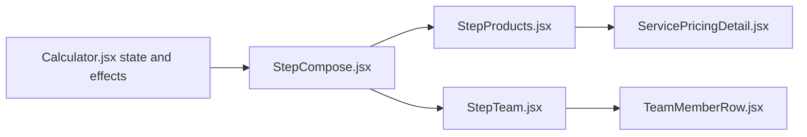

# Compose Step — Architecture Audit

**Deal step ID:** `compose` (UI label: **Scope**)  
**Sections:** `#products`, `#team`  
**Last aligned with codebase:** May 2026

## Related docs

| Doc | Use when |
|-----|----------|
| [compose-step-ui-map.md](compose-step-ui-map.md) | Zone layout, visibility, wireframes |
| [compose-step-issues.md](compose-step-issues.md) | Prioritized problems and fixes |
| [compose-step-redesign-options.md](compose-step-redesign-options.md) | Direction A/B/C and file list |
| [compose-scope-section-redesign-brief.md](compose-scope-section-redesign-brief.md) | Field-level tables, APIs, segment payloads |
| [scope-section-redesign-brief.md](scope-section-redesign-brief.md) | Opportunity / BD scope (not compose) |

---

## Executive summary

The Scope step is implemented as **two stacked cards** (Products + Team) inside a **three-column shell** (sidebar, main, insight rail), with **two sticky summary layers** above the scroll region (app header + quote health strip). State and side effects live almost entirely in [`Calculator.jsx`](../frontend/src/pages/Calculator.jsx); child components are mostly presentational.

**Why it feels fragmented:** The user configures scope in the main column, sees quote outcomes in the header and right rail, edits margins on a different deal step (Economics), and team can change silently via debounced auto-sync—without a single “Scope workspace” frame tying those surfaces together.

---

## Component ownership



| Layer | File | Responsibility |
|-------|------|----------------|
| Page shell | `Calculator.jsx` | Grid, visibility, catalog, `selectedProducts`, `calcData`, calculate, warnings, dialogs |
| Step wrapper | `StepCompose.jsx` | Renders products then team; gates `onContinue` on products when team visible |
| Products UI | `StepProducts.jsx` | Card, toolbar, product rows |
| Sheet panel | `ServicePricingDetail.jsx` | Per-row O/J/L, badges, deliverables dialogs |
| Team UI | `StepTeam.jsx` | Picker, member list, risk collapsible |
| Member row | `TeamMemberRow.jsx` | Hours, utilization, hybrid, seconded |
| Chrome | `DataSourcesStatus`, `QuoteHealthStrip`, `InsightRail` | Sync status, global metrics, rail breakdown |
| Step rules | `quoteSteps.js` | `compose` → `['products','team']`, completion logic |
| Pricing libs | `marginEngine.js`, `pricingCostRules.js` | Product lines, execution modes, team auto-sync rules |

**Not on compose step:** [`MarginControlCenter.jsx`](../frontend/src/components/calculator/MarginControlCenter.jsx) renders only under Economics (`StepEconomics.jsx`, section `#pricing`).

---

## State owned by Calculator.jsx

### `selectedProducts`

Array of line items:

```js
{ id, product_name, size, quantity, margin_percent?, margin_source?, locked? }
```

- **Initial row:** `size: 'tiny'`, `quantity: 1` (empty service).
- **Opportunity import:** `size: 'standard'` (inconsistency with manual add).
- **Family filter:** `selectedSection` + `filteredProductsCatalog` — filter affects dropdown options only, not existing rows.

### `productsPricingCatalog`

From `GET /api/sheets/products-pricing`. Each service has `segments[segmentKey]` with sheet fields used by `ServicePricingDetail` and `buildTeamMembersFromProducts`.

### `calcData` (compose-relevant)

- `team_members[]` — synced from products or added via `DepartmentRolePicker`.
- `internal_risk` — `{ complexity, rush, execution }` each `none|low|medium|high`.
- `margin_mode` — granular vs other modes; product lines built when granular.

### UI / link state

| State | Purpose |
|-------|---------|
| `composeSubTab` | `'products'` \| `'team'` on viewports `< lg` |
| `expandAllSections` | Show all deal sections in one scroll |
| `productsTeamLink` | Set to `'replace'` after auto-sync; surfaced in `InsightRail` / alerts |
| `sheetPriceFloorWarning` | Selling below sum of sheet base min (O) |
| `applyProductsDialogOpen` | Replace vs append team from Apply button |

---

## Visibility (`isSectionVisible`)

Logic in `Calculator.jsx` (~1067–1078):

1. `expandAllSections` → every section visible (including Opportunity, Economics, Review blocks).
2. `review` → only when `activeDealStep === 'review'`.
3. Other sections → only if their deal step matches `activeDealStep`.
4. **Compose + mobile:** only `products` OR `team` per `composeSubTab`.

**IntersectionObserver** (~1081–1098): Updates `activeDealStep` from visible `#project`, `#products`, `#team`, etc. Can fight manual step clicks when “Show all sections” is on.

---

## Data flow

```mermaid
sequenceDiagram
  participant Sheet as Google Sheet catalog
  participant API as products-pricing API
  participant Calc as Calculator
  participant Rows as StepProducts
  participant Team as calcData.team_members
  participant APIcalc as calculate API

  Sheet --> API --> Calc
  Calc --> Rows
  Rows -->|segment payload| ServicePricingDetail
  Calc -->|buildTeamMembersFromProducts| Team
  Calc -->|buildProductLines if granular| APIcalc
  Team --> APIcalc
  APIcalc -->|results| QuoteHealthStrip
  APIcalc -->|results| InsightRail
```

### Catalog → row

1. User picks service → segment reset to **first** key on that product.
2. `getSegmentPayload(product, size)` feeds `ServicePricingDetail`.

### Products → team (two paths)

| Path | Trigger | UX |
|------|---------|-----|
| Auto-sync | `useEffect`, 300ms debounce | Replaces `team_members` when syncable segments change; sets `productsTeamLink` |
| Apply to team | Violet button → dialog | `handleApplyProducts` → replace or append |

**Syncable segments:** `shouldAutoSyncTeamFromSegment(seg)` in `pricingCostRules.js` — resource/hybrid execution modes; all-in skipped to avoid labor double-count.

`buildTeamMembersFromProducts` aggregates `internal_roles` hours × qty, matches roles by name (`findRoleMatch`).

### Calculate

`handleCalculate` (~510+):

- Builds `product_lines` via `buildProductLines(selectedProducts, …)` when `margin_mode === 'granular'`.
- Compares `results.selling_price` to `getSheetMinimumTotal()` for `sheetPriceFloorWarning`.
- Debounced recalc on dependency changes (~581).

---

## Step completion (`quoteSteps.js`)

```js
case 'compose':
  return hasValidProduct || calcData.team_members.length > 0;
```

Scope can be “complete” with **only team** and no catalog lines—encourages skipping the products builder.

---

## Cross-step: Economics and margins

| Configured on Scope | Edited on Economics |
|---------------------|---------------------|
| Service, segment, qty | Per-product `margin_percent`, lock, source |
| Inline sheet O/J/L preview | `MarginControlCenter` / `ProductPricingCard` |
| Team hours from sheet roles | Vendor costs, payment terms |
| `internal_risk` dropdowns | Global margin mode, guidelines |

`marginEngine.buildProductLineFromSelection` resolves default margin from segment + `calcData`; granular selling uses `sellingFromCostAndMargin`.

**Opinion:** Scope shows **cost-side** sheet truth; Economics shows **price-side** control—users must connect mentally unless redesign unifies them.

---

## ServicePricingDetail (architectural role)

Embedded in each product row when `product_name && size`. Reads `segmentData` only (no direct API).

**Displays:** Base min (O), total cost (J), optional min selling (L), execution badges, team hours badge, cost basis copy, Deliverables/Modifications/Detailed sheet/Reference actions.

**Does not:** Persist margin overrides or write back to sheet.

---

## TeamMemberRow (architectural role)

- Modes: internal hours vs utilization toggle, seconded with markup, hybrid via `getChargeableHours` / `EXECUTION_HYBRID`.
- Can quick-create roles via API (`quickCreateRole`).
- Large inline form per member—contributes to vertical scroll on Scope.

---

## CSS / Tailwind patterns

Defined in [`index.css`](../frontend/src/index.css) and repeated inline:

| Class / pattern | Usage on compose |
|---------------|------------------|
| `.dark-card` | Products + Team cards (`bg-neutral-900 border-neutral-800`) |
| `.glass-header` | App header sticky `z-50` |
| `.quote-panel-enter` | Section enter animation |
| `.quote-price-pulse` | Health strip on price change |
| `.status-healthy` / `.status-risk` / `.status-danger` | Available; margin uses inline emerald/amber/rose |
| `.financial-number` | Mono tabular amounts |
| `animate-fade-in` | Section wrappers |

**Accent colors (inline):**

| Accent | Components |
|--------|------------|
| Violet (`violet-500/600`) | Products icon, Apply to team, `ServicePricingDetail` panel |
| Blue | Team icon, Modifications button in detail |
| Emerald | Money figures (O), sync dot, margin good |
| Indigo | `StepContinueFooter` CTA |
| Amber | Deliverables, stale data |

---

## Test IDs (compose-relevant)

| testid | Component |
|--------|-----------|
| `header` | App header |
| `quote-health-strip` | QuoteHealthStrip |
| `data-sources-status` | DataSourcesStatus |
| `expand-all-sections` | Show all switch |
| `products-pricing-toolbar` | Products toolbar |
| `team-section` | Team card |
| `dashboard` | InsightRail |
| `margin-control-center` | Economics only |

---

## Peripheral chrome (compose context)

| Component | Role |
|-----------|------|
| `DealStepper` | Horizontal (all widths) + vertical (lg sidebar) |
| `TemplatePanel` | Load/save scope templates (products + team) |
| `BottomNav` | Mobile step + insight + expand-all |
| `InsightSheet` | Mobile insight drawer |
| Apply team dialog | In `Calculator.jsx` (replace/append) |

---

## APIs touched during Scope work

| Endpoint | When |
|----------|------|
| `GET /api/sheets/products-pricing` | Catalog load / refresh |
| `GET /api/roles` | Team picker, auto-sync match |
| `POST /api/calculate/simple` | After team/products/vendor changes |
| `GET /api/scope-templates` | Sidebar templates |

Opportunity lookup runs on **frame** step, not compose.

---

## Key file references

- Visibility: `Calculator.jsx` `isSectionVisible`, `composeSubTab`, lines ~1067–1296
- Auto-sync: `Calculator.jsx` lines ~455–476
- Apply team: `Calculator.jsx` `handleApplyProducts` ~496–507
- Continue split: `StepCompose.jsx` lines 9–12
- Sheet floor: `getSheetMinimumTotal` ~346+

For exhaustive UI copy and wireframes, see [compose-step-ui-map.md](compose-step-ui-map.md).
