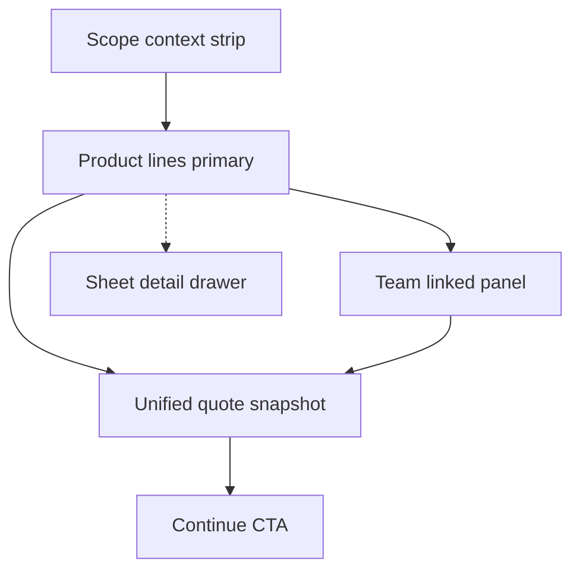

# Compose Step — Redesign Options

Practical directions to make Scope feel like **one coherent workspace**, not stacked mini-apps.  
**No implementation in this doc** — decision guide only.

**Related:** [compose-step-issues.md](compose-step-issues.md) · [compose-step-ui-map.md](compose-step-ui-map.md) · [compose-step-audit.md](compose-step-audit.md)

---

## Ideal information hierarchy

Target order of attention (top → bottom):

1. **Scope context strip** — sync status, valid line count, aggregate sheet floor (Σ O), link to opportunity lines  
2. **Primary work area** — product lines (dominant width, always visible)  
3. **Secondary panel** — team derived from products (preview + edit, visually linked)  
4. **Tertiary / on demand** — sheet detail drawer, deliverables, risk factors  
5. **Single quote outcome** — selling price + margin in **one** sticky place (not header + rail duplicate)  
6. **Single step action** — one “Continue to Economics” sticky at Scope bottom  



---

## Three layout options

### Option A — Unified Scope shell (recommended default)

**Concept:** One card (or one bordered workspace) with **Products | Team | Risk** as horizontal tabs on **all** breakpoints (not only mobile).

| Pros | Cons |
|------|------|
| Clearest “one step” mental model | Requires new shell component |
| Easy single footer CTA | Tab state to persist |
| Sheet detail moves to right drawer or modal | Medium refactor |

**Structure:**

```text
┌─ Scope ─────────────────────────────────────────────┐
│ [sync · 3 lines · floor Σ O]                        │
│ [Products] [Team] [Risk]                             │
│ ┌─────────────────────────────────────────────────┐ │
│ │ tab content                                      │ │
│ └─────────────────────────────────────────────────┘ │
│                        [Continue to Economics]       │
└─────────────────────────────────────────────────────┘
```

**Best when:** You want fastest path to coherence without rethinking economics.

---

### Option B — Split-pane workspace

**Concept:** Desktop `60/40` — products left, team right; shared Scope header. Mobile stacks with sticky segment control.

| Pros | Cons |
|------|------|
| See products + team simultaneously | Narrow columns on 1280px |
| Natural “preview” for sync | More layout CSS |
| Good for power users | Risk panel still needs home |

**Best when:** Team sync is central and users constantly compare hours to lines.

---

### Option C — Table-first builder

**Concept:** Dense table rows (service, segment chips, qty, margin %, actions); detail flyout; team as expandable sub-grid per line or global table below.

| Pros | Cons |
|------|------|
| Scales to many lines | Steeper design/dev cost |
| Less vertical scroll | Harder for rich sheet copy (deliverables) |
| Familiar spreadsheet mental model | Mobile table UX needs care |

**Best when:** Typical deals have 10+ scope lines.

---

## Per-area recommendations

### Products builder

| Current | Recommended |
|---------|-------------|
| 12-col row + inline `ServicePricingDetail` | **Collapsed row**: service + segment chips + qty + chevron → drawer |
| Family filter dropdown | Horizontal **family chips**; show count of selected per family |
| Violet Apply button in toolbar | Demote to secondary; primary sync lives with team panel |
| Add row default `tiny` | Default **`standard`**; match opportunity import |

**Files:** `StepProducts.jsx`, `ServicePricingDetail.jsx` (drawer variant)

---

### Team section

| Current | Recommended |
|---------|-------------|
| Separate blue card below | **Linked panel** under Products tab or right pane (Option B) |
| Auto-sync + Apply dialog | **One flow:** “Update team from products” → diff preview → Apply / Undo |
| `TeamMemberRow` always expanded | Compact row + expand; or table columns: Role, Hours, Rate, Cost |

**Files:** `StepTeam.jsx`, `TeamMemberRow.jsx`, `Calculator.jsx` (remove silent effect or gate behind banner)

---

### Risk factors

| Current | Recommended |
|---------|-------------|
| Collapsible at bottom of Team | **Scope tab “Risk”** or inline strip: Complexity · Rush · Execution |
| Only visible when team exists | Visible whenever on Scope step (quote-level inputs) |

**Files:** `StepTeam.jsx` → extract `ScopeRiskPanel.jsx`

---

### Right rail / summary

| Current | Recommended |
|---------|-------------|
| Full duplicate of header metrics + deep COGS | On Scope: **slim snapshot** (price, margin, floor warning, 1-line alert) |
| COGS collapsibles open by default | Collapsed on Scope; expand on Economics / Review |
| Empty → “Go to Scope” | Keep |

**Alternative:** Hide rail on Scope; rely on health strip only — frees 360px for split-pane.

**Files:** `InsightRail.jsx`, `Calculator.jsx` (conditional rail mode by `activeDealStep`)

---

### Continue CTA placement

| Current | Recommended |
|---------|-------------|
| `StepContinueFooter` inside Team (and sometimes Products) | **One footer** on `StepCompose` wrapper, `sticky bottom` within main column |
| Indigo button at card end after long scroll | Sticky bar: `Continue to Economics` + optional `Save template` |

**Files:** `StepCompose.jsx`, `StepProducts.jsx`, `StepTeam.jsx` (remove per-card footers)

---

### Cross-step: Economics margins

| Current | Recommended |
|---------|-------------|
| Margin % only in `MarginControlCenter` | Row-level margin chip on Scope **or** “Edit pricing” jumps to Economics with line highlighted |
| Granular mode unclear from Scope | Badge on Scope strip: “Granular pricing” when active |

**Files:** `MarginControlCenter.jsx`, `ProductPricingCard.jsx`, `marginEngine.js`

---

## Comparison matrix

| Criterion | A Unified shell | B Split-pane | C Table-first |
|-----------|-------------------|--------------|---------------|
| Coherence | High | High | Medium-high |
| Dev effort | Medium | Medium-high | High |
| Mobile fit | Good (tabs) | Good (stack) | Needs design |
| Many lines | OK | OK | Best |
| Sheet detail UX | Drawer | Drawer | Flyout |

**Recommendation:** Start with **Option A** + slim rail + drawer detail. Consider **C** later if line count is routinely high.

---

## Files likely to change (by priority)

### P0 — Scope shell and flow

- [`frontend/src/pages/Calculator.jsx`](../frontend/src/pages/Calculator.jsx) — visibility, auto-sync, layout props, rail mode  
- [`frontend/src/components/calculator/StepCompose.jsx`](../frontend/src/components/calculator/StepCompose.jsx) — tabs, unified footer  
- [`frontend/src/components/calculator/StepProducts.jsx`](../frontend/src/components/calculator/StepProducts.jsx) — row layout, toolbar  
- [`frontend/src/components/calculator/StepTeam.jsx`](../frontend/src/components/calculator/StepTeam.jsx) — panel vs card  

### P1 — Detail and chrome

- [`frontend/src/components/ServicePricingDetail.jsx`](../frontend/src/components/ServicePricingDetail.jsx) — drawer/sheet variant  
- [`frontend/src/components/calculator/DataSourcesStatus.jsx`](../frontend/src/components/calculator/DataSourcesStatus.jsx) — merge into Scope strip  
- [`frontend/src/components/calculator/QuoteHealthStrip.jsx`](../frontend/src/components/calculator/QuoteHealthStrip.jsx) — dedupe with rail  
- [`frontend/src/components/calculator/InsightRail.jsx`](../frontend/src/components/calculator/InsightRail.jsx) — step-aware density  
- [`frontend/src/components/calculator/StepContinueFooter.jsx`](../frontend/src/components/calculator/StepContinueFooter.jsx) — sticky scope variant  

### P2 — Team and alerts

- [`frontend/src/components/TeamMemberRow.jsx`](../frontend/src/components/TeamMemberRow.jsx)  
- [`frontend/src/components/DepartmentRolePicker.jsx`](../frontend/src/components/DepartmentRolePicker.jsx)  
- [`frontend/src/components/calculator/IntelligenceAlerts.jsx`](../frontend/src/components/calculator/IntelligenceAlerts.jsx)  
- [`frontend/src/index.css`](../frontend/src/index.css) — scope workspace tokens  

### P3 — Cross-step

- [`frontend/src/components/calculator/StepEconomics.jsx`](../frontend/src/components/calculator/StepEconomics.jsx)  
- [`frontend/src/components/calculator/MarginControlCenter.jsx`](../frontend/src/components/calculator/MarginControlCenter.jsx)  
- [`frontend/src/lib/marginEngine.js`](../frontend/src/lib/marginEngine.js)  
- `ProductPricingCard.jsx` (if present in economics stack)  

### New components (suggested)

- `ScopeWorkspace.jsx` — shell + tabs + sticky footer  
- `ScopeContextStrip.jsx` — sync, counts, floor  
- `ProductLineRow.jsx` — collapsed row + open detail  
- `ScopeRiskPanel.jsx` — extracted risk UI  
- `TeamSyncBanner.jsx` — undo after product-driven team update  

---

## Phased rollout

### Phase 1 — Chrome consolidation (low risk)

- Dedupe quote metrics (header **or** rail on Scope).  
- Merge sync UI into one strip.  
- Single Continue footer on `StepCompose`.  
- Team sync banner + disable silent replace (or require opt-in).

**Outcome:** Feels less noisy without restructuring rows.

### Phase 2 — Products row UX

- Collapsed rows + detail drawer.  
- Segment chips.  
- Family chips filter.

**Outcome:** Less scroll, clearer line focus.

### Phase 3 — Team integration

- Option A tabs or Option B split-pane.  
- Unified sync from products with preview.

**Outcome:** Products and team read as one system.

### Phase 4 — Economics alignment

- Margin chip / deep link from Scope rows.  
- Consistent granular labeling.

**Outcome:** Cost (Scope) and price (Economics) still separate steps but linked.

---

## Success criteria (acceptance)

- [ ] User can see product lines and team relationship without scrolling past unrelated chrome.  
- [ ] Selling price and margin appear once on Scope (secondary breakdown optional).  
- [ ] Team changes from products are never silent.  
- [ ] Exactly one primary CTA to leave Scope.  
- [ ] Sheet detail available on demand, not inline per row by default.  
- [ ] Risk factors discoverable without expanding buried collapsible.

---

## Decision log (fill when chosen)

| Decision | Choice | Date |
|----------|--------|------|
| Layout option | A / B / C | |
| Rail on Scope | Slim / Hidden / Full | |
| Auto-sync | Banner+undo / Manual only | |
| Margin on Scope | Inline / Link only | |
