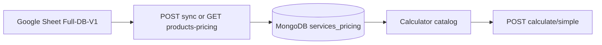
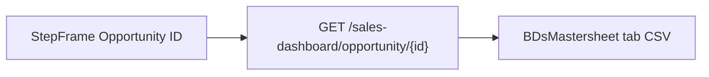

# Data Flow — Pricing

## Sync paths

1. **Startup / refresh:** `GET /api/sheets/products-pricing?force_refresh=true` → fetch CSV → upsert MongoDB → grouped JSON to UI.
2. **Cached read:** `GET /api/sheets/products-pricing` → read MongoDB; if empty, sync from sheet.
3. **Stale fallback:** If sheet HTTP fails but DB has rows → `status: stale`, same data, warning message.
4. **Admin:** `POST /api/sheets/sync-products-to-db` (admin password).

## UI state

- `productsPricingCatalog` — grouped services with `segments[segment]` payload (all sheet columns).
- `selectedProducts` — user picks service + segment + qty; optional `margin_percent`, `baseline` via team sync.
- `calcData` — team, vendors, margins, `margin_mode`.
- `handleCalculate` — builds `product_lines` when granular; posts to API.

## API payload (granular)

`product_lines[]` includes resolved `cost`, `execution_mode`, sheet cost columns, margins, floors.

Team members may include `baseline_hours`, `labor_charge_context: hybrid`.

## Response

- `selling_price`, `cogs`, `contribution_margin_percent`
- `margin_breakdown` when granular
- `warnings` (margin, sheet floor, hybrid utilization, product lines)

## Opportunity lookup (BDsMastersheet)

- Sheet ID: same as Sales Dashboard (`1tmeFdbc887Bn7UpsWFLvZpGYnC8huGe8qBetSWYkQYA`), tab `BDsMastersheet`.
- Data rows scanned from **row 5** onward (0-based index 4).
- Columns: A ID, B BD owner, D source, M client, N project name, P scope.
- Scope parsing: numbered lists (`27. Service, 9. Service`) or plain comma / Arabic comma lists (`a, b, c`) — see [`opportunityScope.js`](../frontend/src/lib/opportunityScope.js) (mirrored in backend).
- Catalog match on frontend after load.
- **Continue to Scope:** confirm dialog adds matched products to `selectedProducts` (default segment `standard`).
