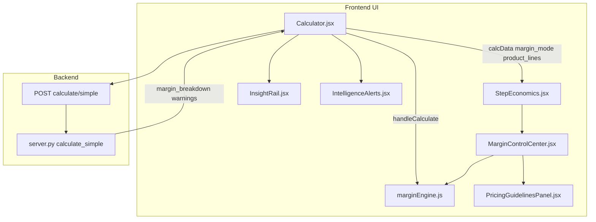
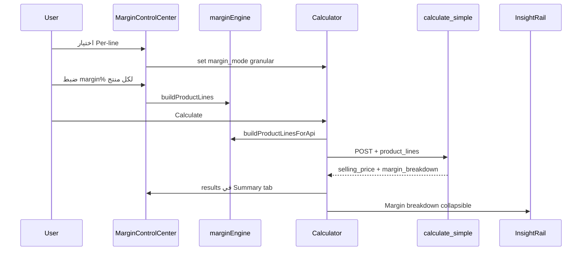

# Margin Control Center — تحليل وتصدير MD

> **الاستخدام:** انسخ هذا الملف أو احفظه كـ `docs/margin-control-center.md` للمراجعة مع الفريق أو في Notion/Figma.

---

## 1. ملخص تنفيذي

**Margin Control Center** هو قسم **Economics / Pricing** في حاسبة العروض. يجمع:

- اختيار **استراتيجية الهامش** (Unified / Split / Per-line granular)
- ضبط هوامش **المنتجات** (من Google Sheet: min margin، min selling)
- هوامش **الفريق الداخلي** و**الموردين**
- **ملخص السعر** (price stack) بعد `calculateSimple`

**موقعه في التطبيق:** Calculator → Step **Economics** → قسم `#pricing` (يظهر مع Vendors في نفس الخطوة).

---

## 2. خريطة الملفات والتكامل



| ملف | دور |
|-----|-----|
| [`frontend/src/components/calculator/MarginControlCenter.jsx`](../frontend/src/components/calculator/MarginControlCenter.jsx) | الواجهة الرئيسية (~600 سطر) |
| [`frontend/src/lib/marginEngine.js`](../frontend/src/lib/marginEngine.js) | بناء خطوط المنتج، التحقق، preview، payload API |
| [`frontend/src/components/calculator/StepEconomics.jsx`](../frontend/src/components/calculator/StepEconomics.jsx) | يعرض Vendors ثم `MarginControlCenter` |
| [`frontend/src/pages/Calculator.jsx`](../frontend/src/pages/Calculator.jsx) | `calcData.margin_mode`، `handleCalculate` + `product_lines` |
| [`backend/server.py`](../backend/server.py) | `ProductLineMarginInput`، فرع `granular`، `margin_breakdown` |
| [`frontend/src/components/calculator/InsightRail.jsx`](../frontend/src/components/calculator/InsightRail.jsx) | تفصيل granular في الشريط الجانبي |
| [`frontend/src/components/calculator/IntelligenceAlerts.jsx`](../frontend/src/components/calculator/IntelligenceAlerts.jsx) | تنبيهات هامش + تحذيرات منتج |

---

## 3. هيكل الواجهة (Visual / IA)

### 3.1 Header

| عنصر | وصف |
|------|-----|
| أيقونة | `Target` — emerald |
| عنوان | **Margin control center** |
| وصف ديناميكي | من `getDealComposition().hint` (product-led / hybrid / team-led / vendor-led) |
| **Mode picker** | 3 أزرار: `Unified` \| `Split` \| `Per-line` → `calcData.margin_mode` |

### 3.2 Collapsible: Pricing guidelines

- [`PricingGuidelinesPanel`](../frontend/src/components/PricingGuidelinesPanel.jsx)
- Inputs: `currentMargin` من API، `dealSize`، `category` من أول منتج (branding/campaign/digital/…)

### 3.3 تحذير Hybrid (شرطي)

يظهر إذا `hasProducts && (hasTeam || hasVendors)`:

> Sheet product costs may already include team hours — double-count risk.

### 3.4 Tabs (4)

| Tab | مفعّل عندما | محتوى |
|-----|-------------|--------|
| **Products** | `hasProducts` | بطاقات per-line + أزرار Apply sheet minimums / Sync from target |
| **Internal** | دائماً | Target أو Internal margin % حسب الوضع + COGS labor من results |
| **Vendors** | `hasVendors` | Vendor margin % (split/granular) + قائمة ملخص لكل vendor |
| **Summary** | دائماً | Price stack + contribution margin + gap to target |

### 3.5 Footer

`StepContinueFooter` → Continue to Review

---

## 4. أوضاع الهامش (Margin Modes)

| Mode | `calcData` | تأثير API | متى يُستخدم |
|------|------------|-----------|-------------|
| **unified** | `target_margin_percent`، `use_split_margins: false` | هامش واحد على COGS الكلي (team+vendor+overhead) | عروض بسيطة بدون تفصيل منتجات في الإجمالي |
| **split** | `internal_margin_percent` + `vendor_margin_percent` | داخلية وموردين منفصلين | فريق + موردين بدون granular products |
| **granular** | `product_lines[]` + `internal_margin_percent` + `vendor_margin_percent` | `selling = products + internal + vendors` | كتالوج sheet + فريق/موردين |

**ملاحظة UI:** في Products tab، رسالة تطلب **Per-line** لتفعيل تسعير كل صف في الإجمالي.

---

## 5. نموذج البيانات

### 5.1 `calcData` (Calculator)

```javascript
{
  margin_mode: 'unified' | 'split' | 'granular',
  use_split_margins: boolean,  // true when split
  target_margin_percent: 30,
  internal_margin_percent: 30,
  vendor_margin_percent: 15,
  team_members: [...],
  vendors: [{ id, service_id, quantity, unit_cost, markup_percent, ... }],
  internal_risk, vendor_risk,
  client_type, lead_source,
}
```

### 5.2 `selectedProducts[]` (per catalog line)

```javascript
{
  id, product_name, size, quantity,
  margin_percent,      // override
  margin_source: 'custom' | 'sheet' | 'global',
  locked: boolean,      // Lock icon — custom vs follows sheet/global
}
```

### 5.3 `productLines[]` (مشتق — marginEngine)

```javascript
{
  id, product_name, segment, quantity,
  cost,                    // segment.total_cost * qty
  sheet_min_margin_percent,
  sheet_min_selling,       // base_minimum_selling_price * qty
  margin_percent,
  line_selling,            // max(cost/(1-m), floor)
  validation: { status, label, tone },
}
```

### 5.4 API request (`handleCalculate`)

```javascript
{
  ...calcData,
  margin_mode,
  product_lines: buildProductLinesForApi(lines),  // فقط إذا granular + lines
}
```

### 5.5 API response — `margin_breakdown` (granular فقط)

```javascript
{
  mode: 'granular',
  products_selling, products_cost,
  products: [{ id, product_name, cost, margin_percent, selling, margin_achieved }],
  internal: { cost, selling, margin_achieved },
  vendors: { cost, selling, margin_achieved },
}
```

---

## 6. المعادلات

### 6.1 Frontend — سعر البيع من الهامش

```
selling = cost / (1 - margin%/100)   // margin capped < 100%
line_selling = max(selling, sheet_min_selling)
markupAmount (vendors في VendorRow) = totalCost * markup% / 100
```

مصدر: [`marginEngine.js`](../frontend/src/lib/marginEngine.js) — `sellingFromCostAndMargin`, `buildProductLineFromSelection`

### 6.2 Backend — granular total

```
product_selling = Σ line_sell(cost, margin%, floor)
internal_selling = internal_base_cost / (1 - internal_margin% - incentive%)
vendor_selling = vendor_revenue إذا markup>0 وإلا vendor_cost/(1-vendor_margin%)
total_selling_price = product_selling + internal_selling + vendor_selling
cogs += product_cogs
```

مصدر: [`server.py`](../backend/server.py) ~L1527–1635

### 6.3 التحقق (validation badges)

| status | label | tone |
|--------|-------|------|
| incomplete | Incomplete | neutral |
| below_min_margin | Below min margin | rose |
| below_floor | Below floor (O) | amber |
| ok | OK | emerald |

---

## 7. تدفقات المستخدم



**إجراءات سريعة:**

- **Apply sheet minimums** → `margin_percent = segment.minimum_margin_percent`, `margin_source: sheet`
- **Sync from target X%** → كل المنتجات = `target_margin_percent`, `margin_source: global`
- **Lock/Unlock** على كل سطر — يغيّر `locked` فقط (UX: margin مخصص vs يتبع)

---

## 8. مكوّنات UI فرعية

| مكوّن | ملف | وظيفة |
|--------|-----|--------|
| `MarginRangeBar` | داخل MCC | شريط min/target + نقطة القيمة الحالية |
| `Slider` | shadcn | 0–80% خطوة 0.5 |
| `StackRow` | داخل MCC | صف في price stack (ألوان violet/blue/amber/emerald) |
| `statusBadgeClass` | داخل MCC | emerald/amber/rose/neutral |

**ألوان الوضع الداكن:** `neutral-900` cards، `indigo-600` للوضع النشط، emerald للعنوان.

---

## 9. قواعد التكلفة (V1 — مُنفَّذة)

راجع [`pricing-rules.md`](pricing-rules.md) و [`pricing-engine-mvp.md`](pricing-engine-mvp.md).

- **All-in:** `total_cost` فقط — لا auto-sync للفريق.
- **Resource:** Direct+OH — sync فريق + ساعات كاملة.
- **Hybrid:** `total_cost` باقة شاملة — sync للرؤية؛ labor = ساعات فوق `baseline_hours` فقط.

## 10. فجوات ومخاطر (متبقية)

1. **Utilization/seconded على hybrid:** تحذير API؛ لا delta في V1.
2. **Products tab في Unified/Split:** يعرض البطاقات لكن API لا يرسل `product_lines` إلا في granular — استخدم Per-line.
3. **Vendors tab في MCC:** read-only ملخص؛ التحرير الفعلي في **VendorRow** أعلى الصفحة (Markup % + Markup SAR).
4. **Per-vendor markup vs vendor_margin_percent:** markup > 0 يتجاوز vendor margin في الـ backend.
5. **لا يوجد تعديل margin لكل vendor داخل MCC** — فقط نسبة عامة + قائمة.
6. **Templates:** `margin_mode` + `default_vendors` تُحفظ؛ per-product margin في template جزئياً.

---

## 11. اقتراحات تطوير (عملي + بصري)

### بصري (UX/UI)

- **Price stack دائماً مرئي** (sticky mini-bar) أثناء التمرير في Products tab.
- **ربط بصري** بين slider والـ RangeBar والرقم في Input (animation على تغيير).
- **عمود Markup SAR للمنتجات** (مثل VendorRow): فرق `line_selling - cost`.
- **حالة الوضع:** شارة كبيرة Unified/Split/Granular + tooltip يشرح متى يُستخدم كل وضع.
- **Summary:** رسم stacked bar (Products | Internal | Vendors) بدل قائمة نصية.
- **تبويب Vendors:** توسيع إلى نفس تفاصيل VendorRow أو embed مدمج.

### عملي (منطق/منتج)

- **Dedup hybrid:** خيار "Exclude embedded labor from product cost" أو sync team من sheet فقط.
- **Auto-switch mode:** اقتراح Per-line عند إضافة منتجات sheet.
- **Live calculate:** debounce calculate عند تغيير margin (بدون زر Calculate).
- **تصدير PDF/Excel** لـ margin_breakdown per line.
- **Scope Editor / Admin:** محاذاة واجهة الموردين مع MarginControlCenter.

### قياس نجاح

- نسبة عروض granular vs unified
- عدد `invalidLines` قبل الإرسال
- وقت من فتح Economics حتى Calculate

---

## 12. test-id للاختبار

| test-id | عنصر |
|---------|------|
| `margin-control-center` | القسم |
| `margin-mode-unified` / `split` / `granular` | أزرار الوضع |
| `target-margin-input` | Unified internal target |
| `internal-margin-input` | Split/Granular internal |
| `vendor-margin-input` | Vendor bucket % |
