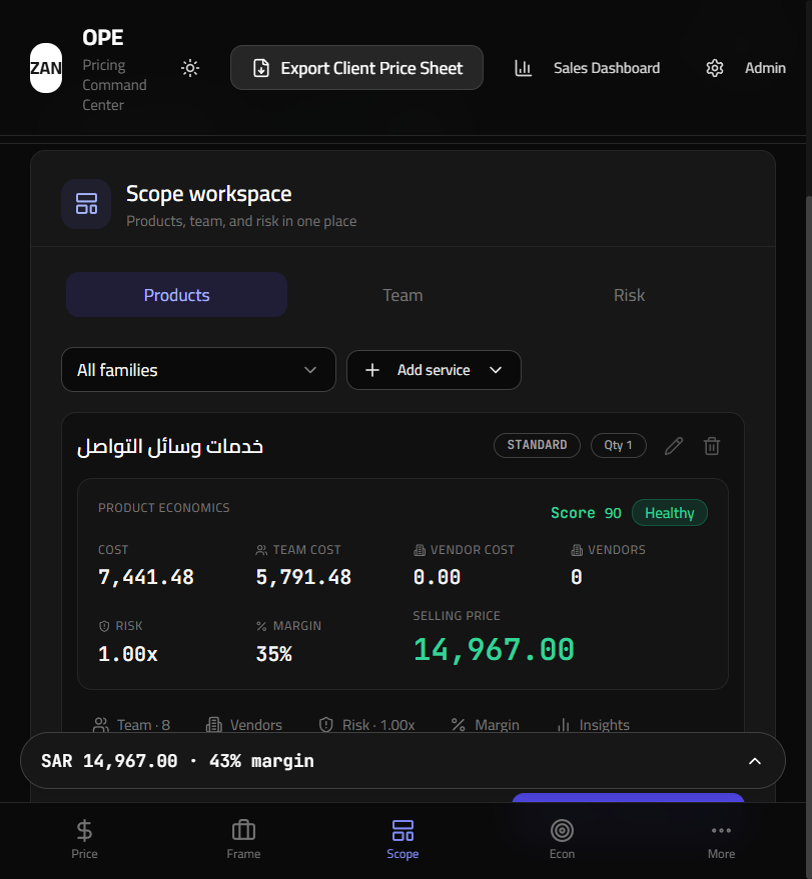
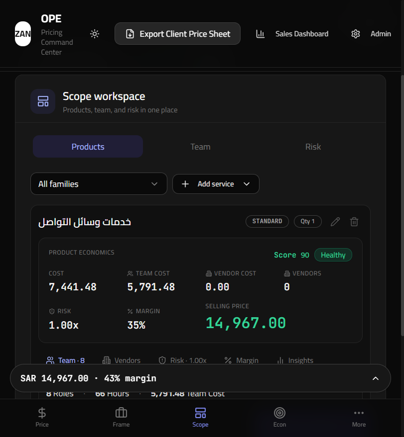
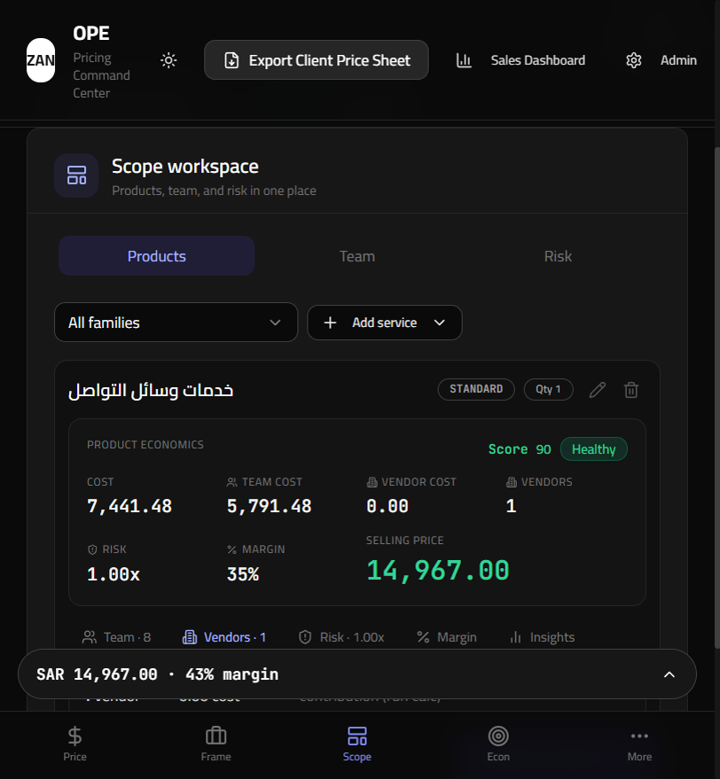
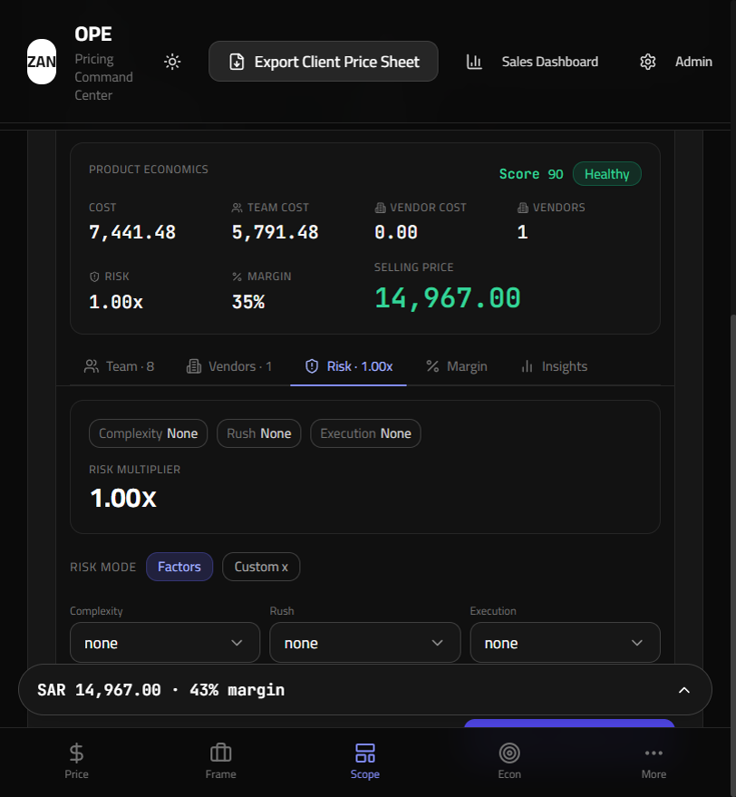
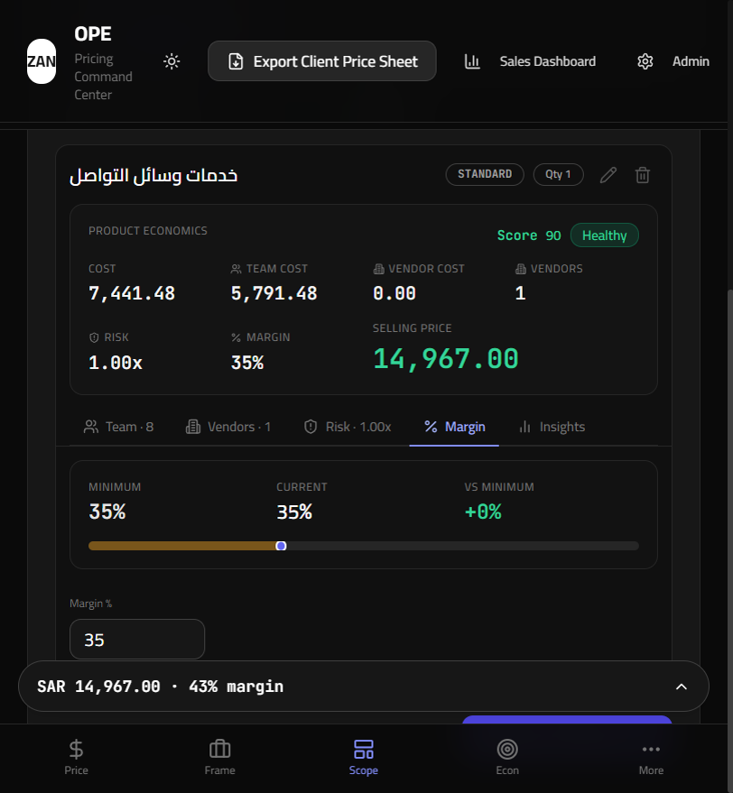
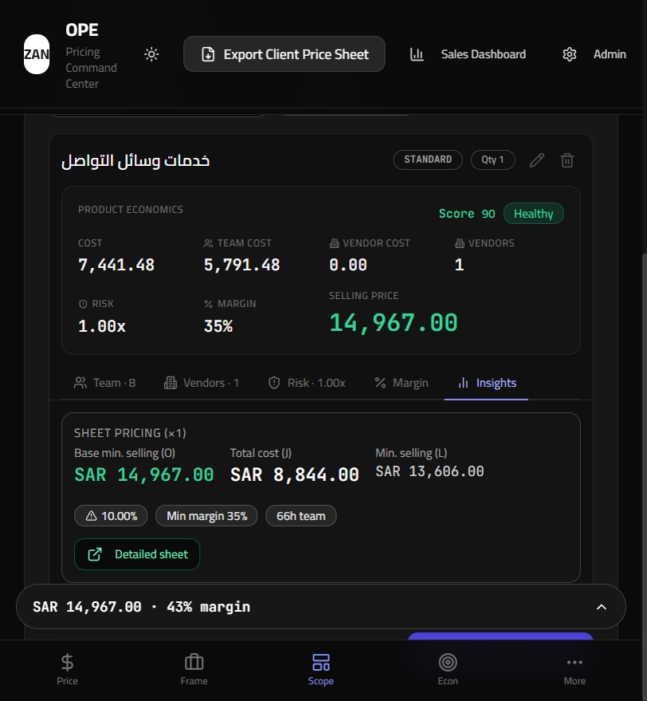
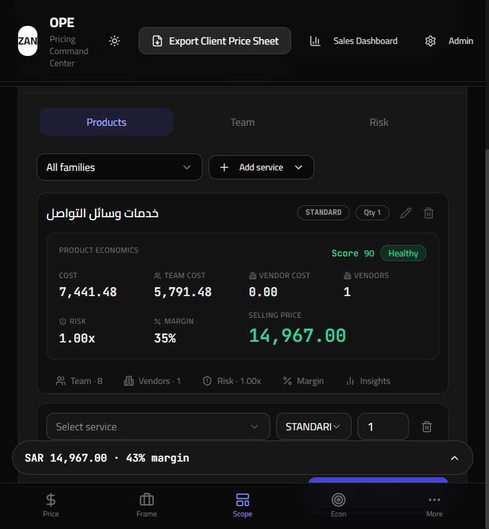
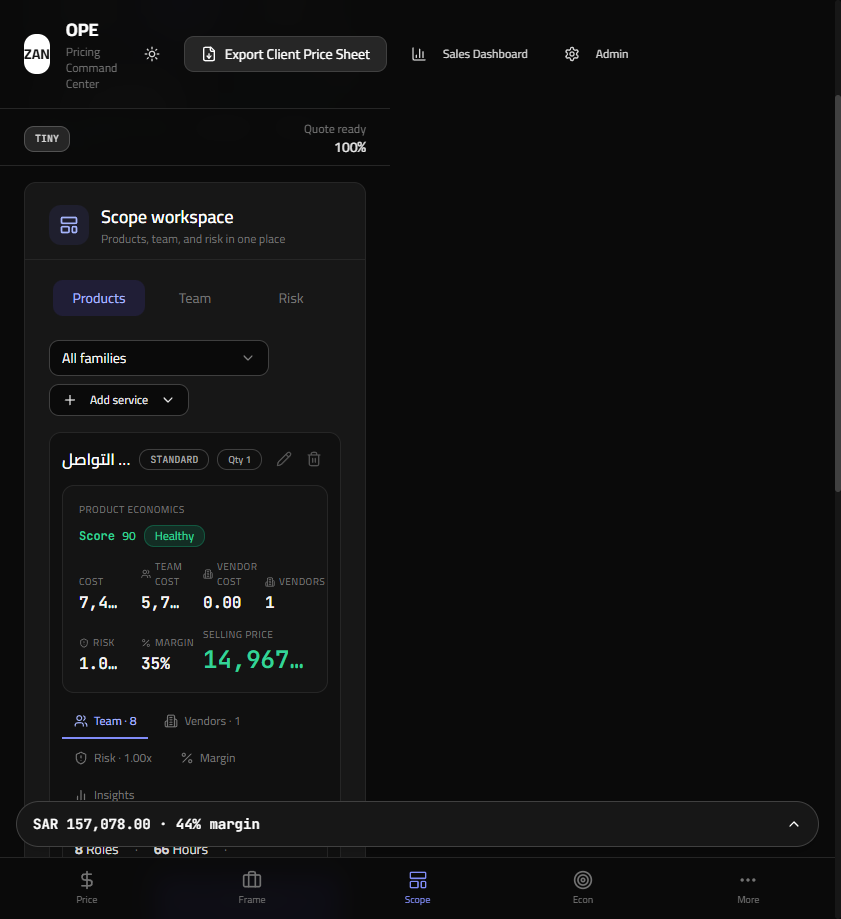
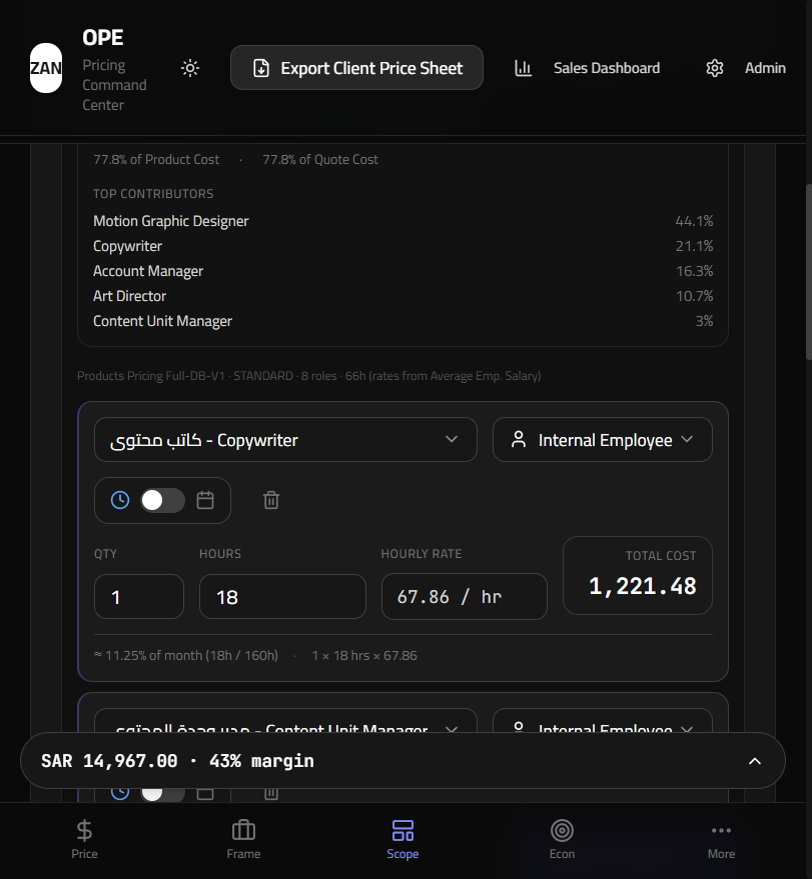

# Product Control Center — Visual QA Report

**Date:** 2026-06-03  
**Branch:** `main`  
**Commit:** `afb5355`  
**Theme:** Dark mode  
**Backend:** `http://localhost:8000` (37 HR roles loaded)  
**Viewport (desktop):** 1440×900  
**Viewport (mobile):** 390×844  

## Test fixture

| Field | Value |
|-------|--------|
| Client | QA Visual Review Client |
| Project | Product Control Center QA |
| Primary product | خدمات وسائل التواصل · STANDARD · Qty 1 |
| Secondary product | نطاق تطوير الهوية · BIG · Qty 1 |
| Vendors | 1 vendor line added (cost 0, markup 15%) |
| Risk | Default factors (all none, 1.00x) |
| Calc | Auto-calculate after product selection |

**Note on scenario 10:** The products-pricing catalog maximum is **8 internal roles per tier** (no sheet tier currently exceeds 8). Scenario 10 uses the expanded 8-role team view from the primary product — the largest team size available in the catalog today.

---

## 1. Product card (collapsed)

**What you're seeing:** Default card state with no control tab open. Header shows service name, STANDARD tier, Qty 1. Product Economics bar displays Cost, Team Cost, Vendor Cost, Vendors count, Risk, Margin, and dominant emerald Selling Price. Health badge (Healthy) and Score 90 appear in the bar corner. Control tabs show counts: Team · 8, Vendors · 1, Risk · 1.00x.

**UX concerns:**
- Product-level margin (35%) differs from quote-level margin in the sticky footer (43%) — correct mathematically with multi-product quotes but may confuse users without a label.
- Header badges (Opportunity, Custom, execution mode) from the spec are not visible on this catalog row; only tier + qty pills show.
- Economics grid uses 8 columns on desktop — readable at 1440px but labels are small (`text-[10px]`).

**Performance:** Instant render; no tab panel mounted. Economics values populate within ~300ms of calc debounce.

---

## 2. Team tab (summary, before Expand Team)

**What you're seeing:** Team tab open with summary-only panel: 8 Roles · 66 Hours · SAR 5,791.48 Team Cost. Contribution context shows 77.8% of Product Cost and 77.8% of Quote Cost. Top 5 contributors listed with team-cost share %. Expand Team button visible; no TeamMemberRow cards rendered.

**UX concerns:**
- Contribution percentages are identical for product vs quote when only one product has calc data — expected, but the duplicate line may look redundant on single-product quotes.
- Top contributors truncate long bilingual role names cleanly; percentage column aligns well.
- Expand Team button sits close to the sticky quote footer on shorter viewports — risk of mis-tap (observed during capture).

**Performance:** Lazy gate works — DOM stays light (summary + 5 list items only). No DepartmentRolePicker or TeamMemberRow until expand.

---

## 3. Team expanded

**What you're seeing:** After Expand Team, TeamMemberRow cards mount with role picker, hours, hourly rate, and Total Cost panel. Sheet hint footer shows Products Pricing Full-DB-V1 · STANDARD · 8 roles · 66h. DepartmentRolePicker department accordion visible below rows.

**UX concerns:**
- Two-row TeamMemberRow layout reads well; Hours column alignment fix holds.
- Bilingual role names (Arabic / English) fit in dropdown triggers but crowd the meta strip on narrow widths.
- DepartmentRolePicker adds significant vertical length — users must scroll past 8 rows + 7 department groups to reach next product on multi-product quotes.

**Performance:** Noticeable DOM expansion (~8 rows + picker tree). Interaction remained responsive at 8 roles; no visible jank on expand. DepartmentRolePicker is the heaviest subtree — defer mounting until expand is the right call.

---

## 4. Vendors tab

**What you're seeing:** Vendors tab with summary strip (1 vendor, vendor cost from calc) and vendor editor row (Select vendor, Cost, Markup %). Add vendor button present. Tab label updated to Vendors · 1; economics bar Vendors count shows 1.

**UX concerns:**
- Vendor cost in economics bar still shows 0.00 while vendor count is 1 — vendor line has no cost/vendor selected yet; summary could hint "incomplete vendor" state.
- Tab panel content sits below economics bar — good hierarchy; vendor row fields are compact.
- Bottom sticky bar partially occludes vendor editor on desktop when scrolled to card bottom.

**Performance:** Lightweight panel — single vendor row, no performance issues.

---

## 5. Risk tab

**What you're seeing:** Risk summary chips (Complexity/Rush/Execution all None), large 1.00x multiplier, selling impact context, and RiskSection with Factors vs Custom toggle plus three factor dropdowns.

**UX concerns:**
- Summary + detail pattern matches Team/Vendors/Margin — consistent.
- All-none state shows 1.00x everywhere — clear baseline.
- Risk tab label shows Risk · 1.00x even when factors are none — good at-a-glance signal.

**Performance:** No issues; small form surface.

---

## 6. Margin tab

**What you're seeing:** Margin summary row (Minimum 35%, Current 35%, vs minimum +0%) with visual delta bar, plus margin percent input/slider in MarginSection.

**UX concerns:**
- At-sheet-minimum state (+0%) is clear; bar visualization helps.
- Product margin (35%) vs footer quote margin (43%) again visible on multi-product quote — label gap.
- Slider + numeric input dual control is familiar; min marker alignment looks correct.

**Performance:** No issues.

---

## 7. Insights tab

**What you're seeing:** ServicePricingDetail compact view — sheet pricing columns (Base min selling, Total cost, Min selling), min margin badge, team hours badge, Detailed sheet link.

**UX concerns:**
- Insights as last tab keeps advanced sheet data out of the default path — good.
- Sheet column labels (O, J, L) assume BD familiarity — acceptable for internal tool.
- Tab content density is high but scannable.

**Performance:** No issues; static read-only content.

---

## 8. Multiple products on one quote

**What you're seeing:** Two product cards stacked — primary (خدمات وسائل التواصل) collapsed with full economics, secondary (نطاق تطوير الهوية · BIG) collapsed below. Quote footer updates to SAR 157,078 · 44% margin.

**UX concerns:**
- Each card is self-contained with its own economics bar and tabs — good isolation.
- Vertical scroll length grows quickly with multiple products; no collapse-all or card minimization beyond default tab-closed state.
- Second card header shows BIG tier badge; first shows STANDARD — tier distinction clear.

**Performance:** Two collapsed cards perform well. Opening Team expanded on both simultaneously would multiply DOM cost — current single-tab-per-card design limits blast radius.

---

## 9. Mobile view (390×844)

**What you're seeing:** Narrow viewport with economics grid wrapping to 2 columns. Team tab summary visible with truncated cost values (7,4… / 5,7… / 14,967…). Bottom nav and sticky quote bar consume ~120px vertical space.

**UX concerns:**
- **P0 mobile:** Economics stat values truncate with ellipsis at 390px — Cost, Team Cost, Risk, and Selling Price lose precision.
- Control tabs wrap to two rows — still usable but Risk/Margin/Insights may wrap off-screen on shorter phones.
- Sticky footer + bottom nav compress usable scroll area; Expand Team button competes with nav for tap targets.
- Header Export button dominates horizontal space on mobile.

**Performance:** Render fine; truncation is layout, not jank.

---

## 10. Large service team (8 roles — catalog max)

**What you're seeing:** Same expanded 8-role team as scenario 3 (خدمات وسائل التواصل · STANDARD). Catalog analysis found **max 8 roles** across all tiers; no 10+ role tier exists in Products Pricing Full-DB-V1 today. نطاق تطوير الهوية · BIG also loads 8 roles.

**UX concerns:**
- At 8 roles, expanded card + DepartmentRolePicker requires substantial scroll — acceptable but worth sticky tab bar consideration.
- Long-scroll role list lacks jump-to-role or department filter within expanded view (picker is add-only below list).

**Performance:** 8-role expand remains responsive. Expect heavier paint if catalog later adds 10–15 role tiers without virtualization — monitor when sheet grows.

---

## Cross-cutting findings

| Priority | Finding |
|----------|---------|
| **P0** | Mobile economics values truncate at 390px — selling price and costs unreadable without horizontal space or smaller grid. |
| **P1** | Product margin vs quote margin shown without distinguishing labels (economics bar vs sticky footer). |
| **P1** | Expand Team / Add vendor buttons conflict with fixed bottom nav — mis-tap risk on mobile and desktop at certain scroll positions. |
| **P2** | Header badges (Opportunity, Custom, execution mode) not surfaced on configured catalog products in this session. |
| **P2** | Vendor count shows 1 while vendor cost 0.00 until vendor fully configured — needs empty-state copy. |
| **P2** | Multi-product quotes increase scroll depth; no card-level collapse beyond tab-closed default. |
| **P3** | Duplicate contribution lines (product % vs quote %) on single-product quotes. |
| **P3** | Catalog max 8 roles — scenario 10 spec assumed 10+; document for sheet owners if larger tiers planned. |

---

## Go / no-go

**Recommendation: Conditional GO** — proceed to the next phase with mobile economics truncation (P0) and margin labeling (P1) tracked as fast-follow polish, not blockers for internal BD use on desktop.

**Validated against spec:**
- Economics-first hierarchy with 8-stat bar and dominant selling price
- Health badge + Score 90 when calc complete
- ProductControlTabs with counts; default no tab open; single-open behavior
- Team lazy-load: summary + Expand Team gate confirmed
- Team summary shows product/quote contribution % and top contributors
- Vendor count in economics bar; Vendors · N tab label
- Risk/Margin/Insights summary-first panels present

**Not validated / out of scope:**
- No code changes in this QA pass
- 10+ role tier not available in current sheet data
