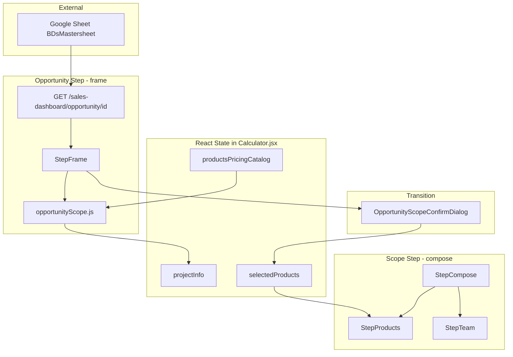
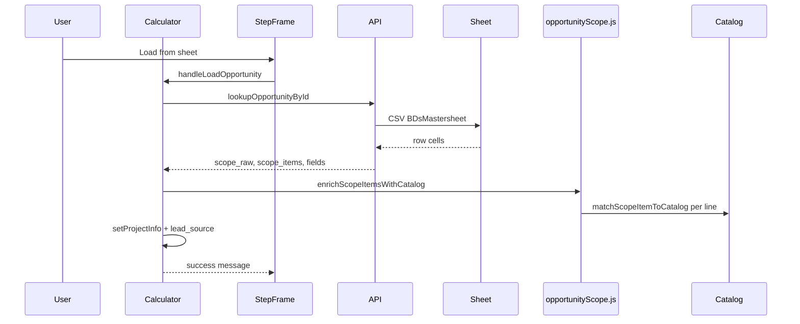
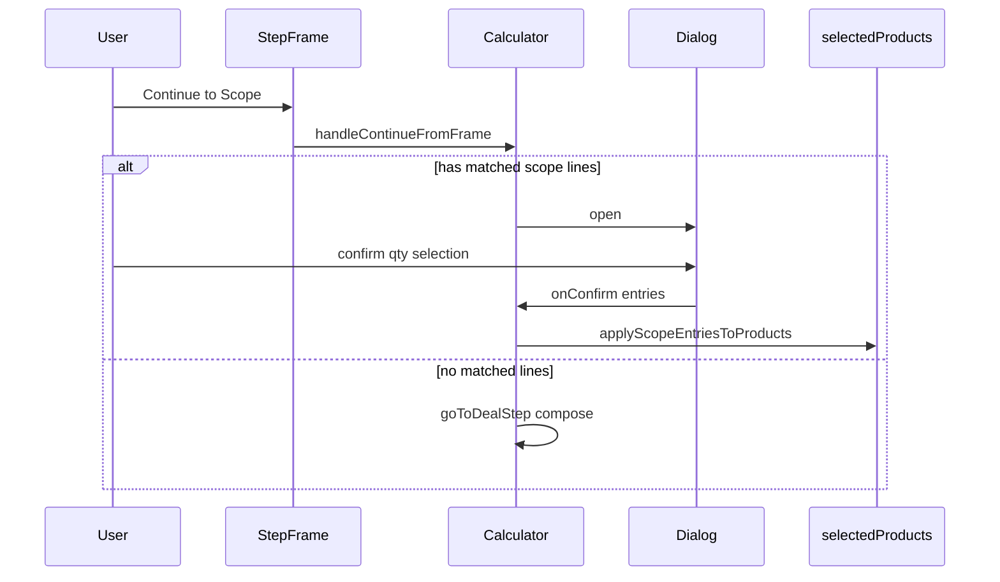

# Scope Section — Redesign Brief

**Purpose:** Export of the current Opportunity + Scope experience in the Calculator (OPE) for UX/UI and architecture redesign.  
**Audience:** Product, design, and engineering.  
**Last aligned with codebase:** May 2026.

> **Compose step (Products + Team + chrome):** See **[`compose-scope-section-redesign-brief.md`](compose-scope-section-redesign-brief.md)** (monolithic reference) or the audit quartet: [`compose-step-audit.md`](compose-step-audit.md), [`compose-step-ui-map.md`](compose-step-ui-map.md), [`compose-step-issues.md`](compose-step-issues.md), [`compose-step-redesign-options.md`](compose-step-redesign-options.md).

---

## 1. Executive summary

The app uses **“scope” in two different places**, which is easy to conflate when redesigning:

| Name in product copy | Deal step | What it is |
|----------------------|-----------|------------|
| **Opportunity scope** | Opportunity (`frame`) | Lines of services from the BD Google Sheet (column P), parsed into rows, matched against the products pricing catalog |
| **Products scope (compose)** | Scope (`compose`) | The pricing builder where users pick catalog services, segment (tiny/standard/big/mega), quantity, and sync team |

**Opportunity scope** is the bridge: it previews what the BD recorded and can **import matched lines** into the Products builder via a confirmation dialog. It does **not** replace the Products builder; unmatched lines stay visible on the Opportunity step for manual follow-up.

**Preferred workflow (by design):**

```text
Opportunity ID → Load from sheet → Review opportunity scope lines → Continue to Scope
  → [Optional] Confirm dialog (qty + catalog picks) → Products pricing builder + Team
```

Nothing auto-adds products without confirmation when at least one line matches the catalog.

---

## 2. User journey

### 2.1 Opportunity step (`frame`)

1. User enters **Opportunity ID** (e.g. `#P260175`) and clicks **Load from sheet**.
2. Backend fetches **BDsMastersheet**, finds the row (from sheet row 5+), returns project fields + raw scope + parsed `scope_items`.
3. UI fills: client, project, sales owner, opportunity source; sets **Lead source** enum (`direct` / `referral`) from sheet source text.
4. **Opportunity scope** section lists one card per parsed line with match badge.
5. User may edit loaded fields (all remain editable).
6. User clicks **Continue to Scope**.

### 2.2 Gate: confirmation dialog

- **Opens when:** `opportunity_loaded === true` AND at least one scope item has `matched === true`.
- **Skipped when:** No matched lines (user goes straight to compose) or user clicks **Skip & continue**.
- **Actions:** Select lines, set quantity (min 1), **Add selected & continue** merges into `selectedProducts`, then navigates to compose.

### 2.3 Compose step (`compose`)

- **Products** (`#products`): `StepProducts` — catalog rows, segment, qty, margins (later in Economics).
- **Team** (`#team`): `StepTeam` — labor rows; can auto-sync from resource/hybrid products.
- Mobile: sub-tabs switch between Products and Team (only one section visible at a time on small screens).

### 2.4 Downstream

- **Economics:** vendors, payment terms, margin control center, calculation.
- **Review:** results, PDF export.

---

## 3. Information architecture

### 3.1 Deal stepper

Defined in [`frontend/src/components/calculator/quoteSteps.js`](../frontend/src/components/calculator/quoteSteps.js):

| Step ID | Label | Section DOM IDs |
|---------|-------|-----------------|
| `frame` | Opportunity | `project` |
| `compose` | Scope | `products`, `team` |
| `economics` | Economics | `vendors`, `pricing` |
| `review` | Review | `review` |

**Frame completion rule:** Any of `opportunity_id`, `client_name`, or `project_name` trimmed non-empty.

**Compose completion rule:** At least one valid product row (`product_name` + `size` + `qty > 0`) OR at least one team member.

### 3.2 StepFrame card zones (Opportunity)

[`StepFrame.jsx`](../frontend/src/components/calculator/StepFrame.jsx) — single card `data-testid="project-info-section"`:

```text
┌─────────────────────────────────────────────────────────┐
│ Header: Project information                            │
├─────────────────────────────────────────────────────────┤
│ Zone A: Opportunity ID + [Load from sheet]             │
├─────────────────────────────────────────────────────────┤
│ Zone B: 2×2 grid                                         │
│   Client name │ Project name                             │
│   Sales owner │ Opportunity Source (sheet col D)         │
├─────────────────────────────────────────────────────────┤
│ Zone C: Opportunity scope (list / empty / placeholder)   │
├─────────────────────────────────────────────────────────┤
│ Zone D: Client type │ Lead source (pricing enums)        │
├─────────────────────────────────────────────────────────┤
│ Footer: [Continue to Scope →]                            │
└─────────────────────────────────────────────────────────┘
```

**Note:** Payment terms were moved to **Economics** (above Margin Control Center). Financing still uses `projectInfo.payment_term_id`.

---

## 4. Architecture overview



### 4.1 Sequence: load opportunity



### 4.2 Sequence: continue to scope



---

## 5. Data model

### 5.1 `projectInfo` (scope-related)

Stored in [`Calculator.jsx`](../frontend/src/pages/Calculator.jsx) `useState`:

| Field | Type | Source | Notes |
|-------|------|--------|-------|
| `opportunity_id` | string | User / sheet col A | Clearing ID clears scope + source |
| `opportunity_source` | string | Sheet col D | Display text; editable |
| `opportunity_scope_raw` | string | Sheet col P | Full cell text before/at parse |
| `opportunity_scope_items` | array | Parsed + enriched | See shape below |
| `opportunity_loaded` | boolean | After successful load | Gates scope UI + dialog |

**Scope item shape (after enrich):**

```typescript
{
  index: number;              // 1-based line number in parsed list
  raw: string;                // Original segment from sheet
  label: string;              // Display label (often English after –)
  catalog_product_name?: string;  // Matched catalog name
  matched: boolean;
}
```

### 5.2 `selectedProducts` (compose)

Each row (from scope import or manual add):

```typescript
{
  id: string;           // e.g. pp-opp-{timestamp}-{random}
  product_name: string;
  size: string;         // Import always uses 'standard'
  quantity: number;
  margin_percent?: number;
  locked?: boolean;
  // ... other margin fields when user edits in Economics
}
```

### 5.3 Dialog-local state

In [`OpportunityScopeConfirmDialog.jsx`](../frontend/src/components/calculator/OpportunityScopeConfirmDialog.jsx) (reset when `open` becomes true):

| State | Purpose |
|-------|---------|
| `selected` | `Set` of row keys `${index}:${catalog_product_name}` |
| `quantities` | `Record<rowKey, number>` default 1 |

On confirm, quantities for the same `catalog_product_name` are **summed** before merge.

### 5.4 `calcData.lead_source` vs `opportunity_source`

| Field | UI | Values | Used for |
|-------|-----|--------|----------|
| `projectInfo.opportunity_source` | Text input | Free text from sheet | BD visibility |
| `calcData.lead_source` | Dropdown | `direct` \| `referral` | Pricing / incentives API |

Backend maps sheet source: substring `"referral"` → `referral`, else `direct`.

---

## 6. Backend API

### 6.1 Endpoint

`GET /api/sales-dashboard/opportunity/{opportunity_id}`

Implemented in [`backend/server.py`](../backend/server.py) (`lookup_sales_dashboard_opportunity`).

| Status | Meaning |
|--------|---------|
| 200 | Row found |
| 400 | Empty ID |
| 404 | ID not in sheet (row 5+) |
| 503 | Sheet fetch/read failure |

### 6.2 Sheet configuration

| Setting | Value |
|---------|--------|
| Spreadsheet ID | `1tmeFdbc887Bn7UpsWFLvZpGYnC8huGe8qBetSWYkQYA` |
| Tab | `BDsMastersheet` |
| First data row | Row 5 (0-based index `4`) |
| Cache | Full tab CSV cached ~5 min (`opportunity_lookup_cache`) |

### 6.3 Column mapping

| Column | Index | Response field |
|--------|-------|----------------|
| A | 0 | `opportunity_id` |
| B | 1 | `sales_owner` |
| D | 3 | `opportunity_source` (+ derived `lead_source`) |
| M | 12 | `client_name` |
| N | 13 | `project_name` |
| P | 15 | `scope_raw` → `scope_items` |

### 6.4 Response example (shape)

```json
{
  "opportunity_id": "#P260175",
  "client_name": "Catch",
  "project_name": "Calculator_Test",
  "sales_owner": "Shatat",
  "opportunity_source": "Referral - إحالة",
  "lead_source": "referral",
  "scope_raw": "استراتيجية الاتصال, بناء هوية جديدة, ...",
  "scope_items": [
    { "index": 1, "raw": "...", "label": "..." },
    { "index": 2, "raw": "...", "label": "..." }
  ]
}
```

Catalog matching fields (`matched`, `catalog_product_name`) are **added on the frontend** after load, not in API response.

---

## 7. Parsing and catalog matching

### 7.1 Shared logic (frontend + backend)

| Layer | File | Functions |
|-------|------|-----------|
| Frontend | [`opportunityScope.js`](../frontend/src/lib/opportunityScope.js) | `hasNumberedScopeItems`, `splitScopeSegments`, `parseScopeText`, `extractScopeLabel`, `matchScopeItemToCatalog`, `enrichScopeItemsWithCatalog` |
| Backend | [`server.py`](../backend/server.py) | `_has_numbered_scope_items`, `_split_scope_segments`, `_parse_opportunity_scope_items`, `_extract_scope_label` |

Tests: [`opportunityScope.test.js`](../frontend/src/lib/opportunityScope.test.js).

### 7.2 Split modes

**Numbered mode** — when text starts with `N.` or contains `, N.`:

```text
27. خدمة تغطية – Event Coverage, 9. خدمة الفيديوجرافي – Videography, 10. ...
```

Split regex: `,\s*(?=\d+\.)`

**Plain comma mode** — otherwise:

```text
استراتيجية الاتصال, بناء هوية جديدة, تطوير الهيكلة, بناء الهيكلة
```

Split regex: `[,،]\s*` (Latin comma + Arabic comma)

### 7.3 Label extraction

1. Strip leading `^\d+\.\s*`
2. If segment contains `–`, `—`, or `-`, use text **after** first separator (English catalog name in bilingual rows)
3. Else use full segment (typical for Arabic-only lines)

### 7.4 Catalog matching

`productsPricingCatalog` entries have `product_name` and/or `service_name`.

1. **Exact** normalized match on `label` vs product/service name
2. **Contains** bidirectional substring match
3. If no match: `matched: false`, empty `catalog_product_name`

**Re-enrichment:** When catalog loads after opportunity, `useEffect` in `Calculator.jsx` re-parses `opportunity_scope_raw` and updates `opportunity_scope_items` if match results change.

### 7.5 Product merge on confirm

[`applyScopeEntriesToProducts`](../frontend/src/pages/Calculator.jsx) in `Calculator.jsx`:

- For each `{ product_name, quantity }`:
  - If row exists with same `product_name` and `size === 'standard'`: **add** to `quantity`
  - Else: **append** new row with `size: 'standard'`
- Returns `{ addedRows, mergedRows }` for toast messaging

---

## 8. Component reference

### 8.1 StepFrame

**File:** [`frontend/src/components/calculator/StepFrame.jsx`](../frontend/src/components/calculator/StepFrame.jsx)

| Prop | Type | Role |
|------|------|------|
| `projectInfo` / `setProjectInfo` | object / fn | All opportunity + scope fields |
| `calcData` / `setCalcData` | object / fn | Client type, lead source |
| `onLoadOpportunity` | fn | Trigger sheet load |
| `onContinue` | fn | `handleContinueFromFrame` (may open dialog) |
| `opportunityLoading` | boolean | Disable load button, show spinner |
| `opportunityLoadError` | string | Red inline error |
| `opportunityLoadSuccess` | string | Green inline success |

**Test IDs:**

| ID | Element |
|----|---------|
| `project-info-section` | Card root |
| `opportunity-id-input` | ID field |
| `opportunity-load-btn` | Load button |
| `opportunity-load-error` | Error text |
| `opportunity-load-success` | Success text |
| `opportunity-source-input` | Opportunity Source |
| `opportunity-scope-section` | Zone C container |
| `client-name-input`, `project-name-input`, `sales-owner-input` | Grid fields |
| `client-type-select`, `lead-source-select` | Zone D |

**Opportunity scope UI states:**

| Condition | UI |
|-----------|-----|
| `!opportunity_loaded` | Dashed placeholder: “Load an opportunity ID…” |
| `opportunity_loaded && items.length === 0` | “No scope lines on this opportunity” |
| `opportunity_loaded && items.length > 0` | List of bordered rows + badges |

**Badge copy:**

- Matched: `Matched → {catalog_product_name}`
- Unmatched: `No Catalog Match`

### 8.2 OpportunityScopeConfirmDialog

**File:** [`frontend/src/components/calculator/OpportunityScopeConfirmDialog.jsx`](../frontend/src/components/calculator/OpportunityScopeConfirmDialog.jsx)

| Prop | Role |
|------|------|
| `open` / `onOpenChange` | Dialog visibility |
| `scopeItems` | Full `opportunity_scope_items` |
| `onConfirm(entries)` | `{ product_name, quantity }[]` |
| `onSkip` | Navigate to compose without adding |
| `isDarkMode` | Theme |

**Matched row layout:**

- Checkbox (default on)
- Sheet label (primary)
- `→ catalog_product_name` (secondary)
- `Matched → {name}` (status line, emerald)
- Qty number input (disabled when unchecked, min 1)

**Unmatched row layout:**

- Muted card, label only, “No Catalog Match” (not selectable)

**Footer summary:** `Matched products: X` | `Selected products: Y`

**Test IDs:** `opportunity-scope-confirm-dialog`, `scope-confirm-summary`, `scope-qty-{index}`

### 8.3 Calculator orchestration

**File:** [`frontend/src/pages/Calculator.jsx`](../frontend/src/pages/Calculator.jsx)

| Function | Responsibility |
|----------|----------------|
| `handleLoadOpportunity` | API call, set `projectInfo`, map `lead_source`, toast |
| `handleContinueFromFrame` | Open dialog if matched lines, else `proceedToComposeStep` |
| `handleScopeConfirmAdd` | Merge products, toast, navigate compose |
| `mergeScopeProductsIntoSelection` | Wrapper around `applyScopeEntriesToProducts` |
| `applyScopeEntriesToProducts` | Pure merge logic on `selectedProducts` |
| `proceedToComposeStep` | `goToDealStep('compose')` |

**API client:** [`lookupOpportunityById`](../frontend/src/lib/api.js) → `GET /sales-dashboard/opportunity/{id}`

### 8.4 Compose (Scope step)

| Component | File | Section ID |
|-----------|------|------------|
| `StepCompose` | [`StepCompose.jsx`](../frontend/src/components/calculator/StepCompose.jsx) | Wrapper |
| `StepProducts` | [`StepProducts.jsx`](../frontend/src/components/calculator/StepProducts.jsx) | `products` |
| `StepTeam` | [`StepTeam.jsx`](../frontend/src/components/calculator/StepTeam.jsx) | `team` |

Scope import does **not** auto-open team sync; user uses existing “Apply products to team” flows in Products/Team.

### 8.5 Legacy / related (not in main flow)

| Artifact | Notes |
|----------|--------|
| [`ScopeEditor.jsx`](../frontend/src/components/ScopeEditor.jsx) | Older multi-scope editor pattern; not used in current Calculator deal stepper |
| `scopeTemplates` in Calculator | Templates API; separate from BDsMastersheet opportunity scope |

---

## 9. UX / UI design spec

### 9.1 Visual system

- **Framework:** React + Tailwind + shadcn/ui (`Card`, `Input`, `Badge`, `Dialog`, `Select`, `Checkbox`)
- **Dark mode default** in Calculator (`isDarkMode === true`)
- **Opportunity card:** `rounded-xl`, neutral borders (`border-neutral-800/60`), `space-y-5` vertical rhythm
- **Scope rows:** `rounded-lg border px-3 py-2.5`, subtle background `bg-neutral-900/30` (dark)
- **Primary CTA:** `StepContinueFooter` — “Continue to Scope” (purple/indigo brand button pattern)

### 9.2 Copy and language

- UI chrome is **English**; sheet data often **Arabic** or bilingual (`Arabic – English`)
- Parser prefers **English segment** after dash for matching; Arabic-only lines rely on contains/exact match against catalog Arabic names if present

### 9.3 Feedback patterns

| Event | Feedback |
|-------|----------|
| Load success | Green inline text + `toast.success` |
| Load failure | Red inline + `toast.error`; scope fields cleared |
| Confirm import | `toast.success` with added/merged counts |
| Match count in success | `Loaded {id} · N scope line(s) matched catalog` |

### 9.4 Accessibility / interaction notes

- Dialog traps focus (shadcn Dialog)
- Qty inputs: `type="number"`, `min={1}`, integer clamp in `clampQty`
- Load button disabled when ID empty or loading
- Confirm disabled when zero rows selected

### 9.5 Responsive behavior

- Opportunity ID row: `flex-col` on small screens, `flex-row` on `sm+`
- Project grid: 1 col mobile, 2 col `sm+`
- Compose on mobile: Products/Team sub-tab bar (only one section visible unless “expand all”)

---

## 10. Integration points (outside scope UI)

| System | How scope connects |
|--------|-------------------|
| Products catalog | `GET /api/sheets/products-pricing` → `productsPricingCatalog` |
| Pricing calculation | `selectedProducts` → `buildProductLines` → `calculateSimple` |
| Incentives | `calcData.lead_source` from sheet mapping |
| Financing | `projectInfo.payment_term_id` on Economics step |
| Sales Dashboard | Same sheet ID; pipeline tab uses different row window (`data_row: 1` vs lookup row 5+) |
| PDF export | `projectInfo` client/project names; products from `selectedProducts` |

---

## 11. Known limitations

1. **No in-UI edit of scope lines** — Users cannot add/remove/reorder lines without editing sheet and reloading (or hacking `opportunity_scope_raw` in state).
2. **Import segment fixed to `standard`** — Dialog does not ask for tiny/big/mega per line.
3. **Matching is heuristic** — Arabic sheet labels may not match catalog English names; false negatives show “No Catalog Match”.
4. **Duplicate catalog names in sheet** — Two lines mapping to same product aggregate qty on confirm (by design) but show as separate dialog rows.
5. **Dual parsers** — Backend and frontend must stay in sync when changing split rules.
6. **Opportunity scope vs Products** — No live link after import; changing scope list does not update Products until user re-confirms.
7. **Sales Dashboard pipeline** — Still ingests from row 1 for analytics; opportunity lookup intentionally starts row 5 (documented in data-flow).

---

## 12. Redesign opportunities (checklist)

Use this as a backlog when redesigning the section.

### 12.1 Information architecture

- [ ] Rename UI labels to distinguish **“BD scope (from sheet)”** vs **“Pricing scope (products)”**
- [ ] Consider moving opportunity scope to its own sub-step or collapsible with stronger hierarchy
- [ ] Show link/sync status between scope lines and product rows after import

### 12.2 Opportunity scope list (Zone C)

- [ ] Editable list: add / remove / reorder lines
- [ ] Manual “Re-match catalog” after products sheet sync
- [ ] Catalog picker for unmatched rows (searchable dropdown)
- [ ] Show confidence tier (exact / fuzzy / none) instead of binary badge
- [ ] Pill/chip layout matching sheet visual (like BDsMastersheet UI)

### 12.3 Confirmation dialog

- [ ] Inline stepper vs modal (less context switch)
- [ ] Segment size per line (tiny/standard/big/mega)
- [ ] Preview of sheet min selling / package cost per line before add
- [ ] “Select all matched” / bulk qty apply

### 12.4 Parsing

- [ ] Centralize parser in one package shared by API and UI (avoid drift)
- [ ] Handle newlines and semicolon separators from sheet
- [ ] Normalize Arabic presentation forms before match
- [ ] Alias table: sheet label → catalog `product_name`

### 12.5 Compose integration

- [ ] Banner on Products step: “3 lines imported from opportunity #P260175”
- [ ] Highlight rows that came from scope import (`source: 'opportunity'`)
- [ ] Auto-navigate to Products sub-tab after confirm

### 12.6 Data / API

- [ ] Optional `POST` to save edited scope back to sheet (out of scope today)
- [ ] Include match metadata in API for debugging
- [ ] Webhook or cache invalidation when BDsMastersheet changes

---

## 13. File reference

| Path | Role |
|------|------|
| [`frontend/src/components/calculator/StepFrame.jsx`](../frontend/src/components/calculator/StepFrame.jsx) | Opportunity UI + scope list |
| [`frontend/src/components/calculator/OpportunityScopeConfirmDialog.jsx`](../frontend/src/components/calculator/OpportunityScopeConfirmDialog.jsx) | Import gate dialog |
| [`frontend/src/components/calculator/StepCompose.jsx`](../frontend/src/components/calculator/StepCompose.jsx) | Scope step wrapper |
| [`frontend/src/components/calculator/StepProducts.jsx`](../frontend/src/components/calculator/StepProducts.jsx) | Products builder |
| [`frontend/src/pages/Calculator.jsx`](../frontend/src/pages/Calculator.jsx) | State + handlers |
| [`frontend/src/lib/opportunityScope.js`](../frontend/src/lib/opportunityScope.js) | Parse + match |
| [`frontend/src/lib/opportunityScope.test.js`](../frontend/src/lib/opportunityScope.test.js) | Unit tests |
| [`frontend/src/lib/api.js`](../frontend/src/lib/api.js) | `lookupOpportunityById` |
| [`frontend/src/components/calculator/quoteSteps.js`](../frontend/src/components/calculator/quoteSteps.js) | Stepper + completion |
| [`backend/server.py`](../backend/server.py) | Lookup API + parse |
| [`docs/data-flow.md`](data-flow.md) | High-level data flow |
| [`docs/ui-ux-notes.md`](ui-ux-notes.md) | UI notes index |

---

## 14. Related documentation

- [Data flow — Opportunity lookup](data-flow.md#opportunity-lookup-bdsmastersheet)
- [UI/UX notes — Project information](ui-ux-notes.md)
- [Pricing engine MVP](pricing-engine-mvp.md) (catalog + calculation, not sheet scope)

---

*End of scope section redesign brief.*
